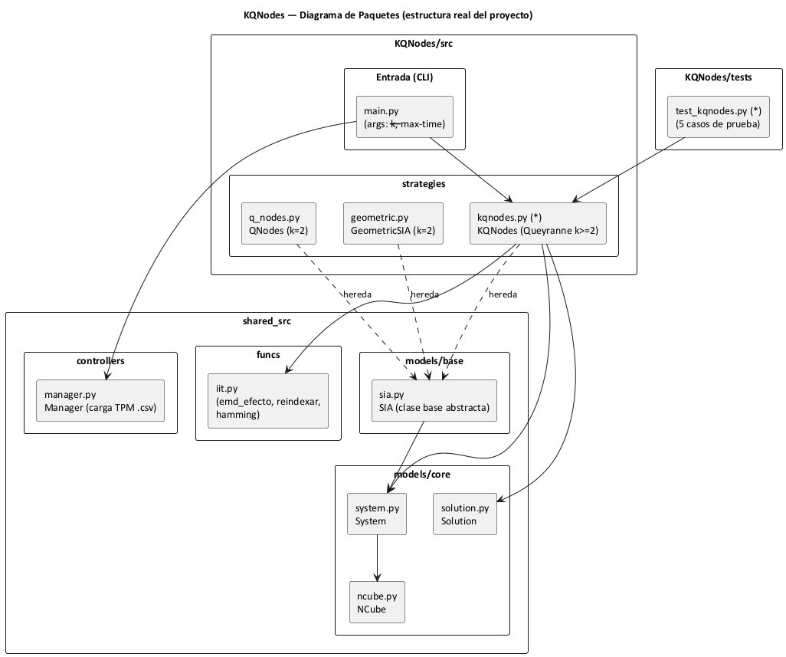
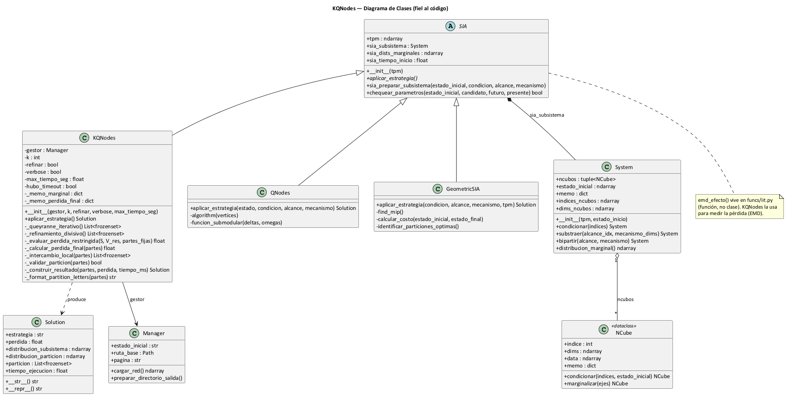
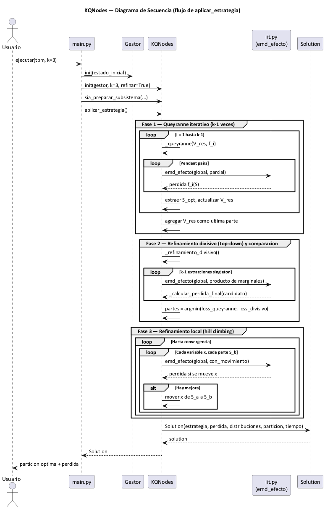
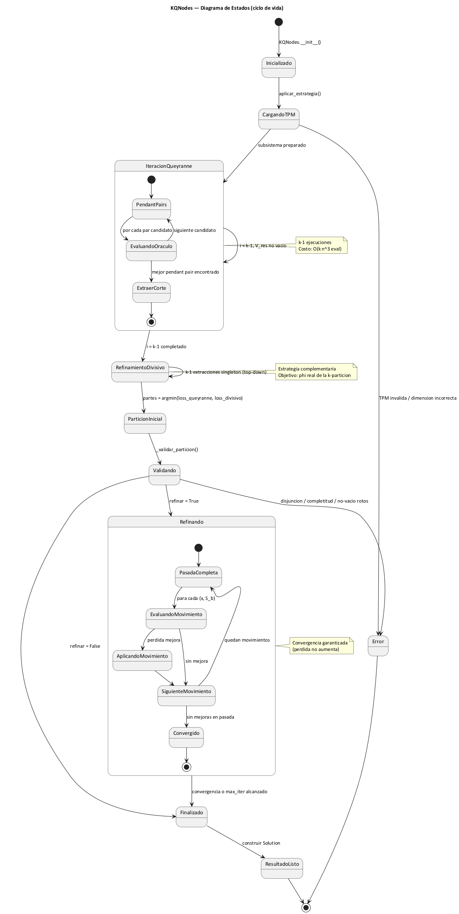

# KQNodes — Diagramas UML

> Diagramas de **paquetes, clases, secuencia y estados** de la implementación de KQNodes.
> La **fuente** está en PlantUML (`KQNodes/docs/diagramas/*.puml`) y se renderiza a PNG
> con `python scripts/render_diagramas.py` (requiere Java + Graphviz). Las imágenes
> incrustadas abajo (`img/*.png`) son las mismas que se usan en el Manual Técnico
> (`Manual_Tecnico_KQNodes.docx`, sección "Diagramas UML").

---

## 1. Diagrama de Paquetes

Estructura real del proyecto: el paquete `KQNodes/src` (CLI + estrategias) sobre el núcleo
compartido `shared_src` (modelos `SIA`, `System`, `NCube`, `Solution`, funciones `iit` y el
`Manager` de carga de TPM).

> Fuente PlantUML: [`diagramas/01_paquetes.puml`](diagramas/01_paquetes.puml)

---

## 2. Diagrama de Clases

`KQNodes` hereda de la clase base abstracta `SIA`, opera sobre un `System` (compuesto de
`NCube`s), recibe la TPM vía `Manager` y produce un `Solution`. Se incluyen además las
estrategias hermanas `QNodes` y `GeometricSIA` (también subclases de `SIA`).

> Fuente PlantUML: [`diagramas/02_clases.puml`](diagramas/02_clases.puml)

---

## 3. Diagrama de Secuencia — Flujo principal de `aplicar_estrategia()`

Tres fases: (1) Queyranne iterativo, (2) refinamiento divisivo y comparación, (3) hill
climbing local. La pérdida se mide siempre con `emd_efecto` (`shared_src/funcs/iit.py`).

> Fuente PlantUML: [`diagramas/03_secuencia.puml`](diagramas/03_secuencia.puml)

---

## 4. Diagrama de Estados — Ciclo de vida de KQNodes

> Fuente PlantUML: [`diagramas/04_estados.puml`](diagramas/04_estados.puml)

---

## 5. Notas de Implementación

### Archivos principales

| Archivo | Rol |
|---|---|
| `KQNodes/src/strategies/kqnodes.py` | Clase `KQNodes(SIA)` — algoritmo k-MIP completo |
| `KQNodes/src/main.py` | Entrada CLI (`--k`, `--max-time`); prepara el subsistema y ejecuta |
| `KQNodes/tests/test_kqnodes.py` | 5 tests unitarios (validez, k=2 vs QNodes, escalabilidad, refinamiento) |
| `shared_src/models/base/sia.py` | Clase base abstracta `SIA` (preparación de subsistema, marginales) |
| `shared_src/models/core/{system,ncube,solution}.py` | `System`, `NCube`, `Solution` |
| `shared_src/funcs/iit.py` | `emd_efecto` y utilidades (reindexado, hamming) |
| `shared_src/controllers/manager.py` | `Manager` — carga de TPM desde `.samples/*.csv` |

### Dependencias internas que reutiliza KQNodes

| Símbolo | Origen | Uso en KQNodes |
|---|---|---|
| `emd_efecto` | `shared_src/funcs/iit.py` | Métrica de pérdida (EMD) — oráculo de Queyranne |
| `substraer` + `distribucion_marginal` | `System` | Marginal de cada parte (cacheado en `_memo_marginal`) |
| `bipartir` + `distribucion_marginal` | `System` | Reconstrucción tipo IIT (misma métrica que QNodes/GeoMIP) |
| `sia_preparar_subsistema` | `SIA` | Condicionar/substraer la TPM y fijar `sia_dists_marginales` |
| `Solution` | `shared_src/models/core/solution.py` | Objeto de resultado estándar |

### Invariantes que KQNodes respeta

- La unión de todas las partes es igual a V completo.
- La intersección de cualquier par de partes es el conjunto vacío.
- Ninguna parte queda vacía.
- Para k=2, KQNodes produce una bipartición válida con la **misma métrica de pérdida** que QNodes (la pérdida coincide con la reconstrucción `bipartir()` tipo IIT). La **partición** puede diferir de la de QNodes porque KQNodes parte variables enteras y QNodes parte vértices por-tiempo (ver Manual Técnico §2.6).
- La pérdida después del refinamiento (hill climbing) nunca aumenta respecto a la inicial.
