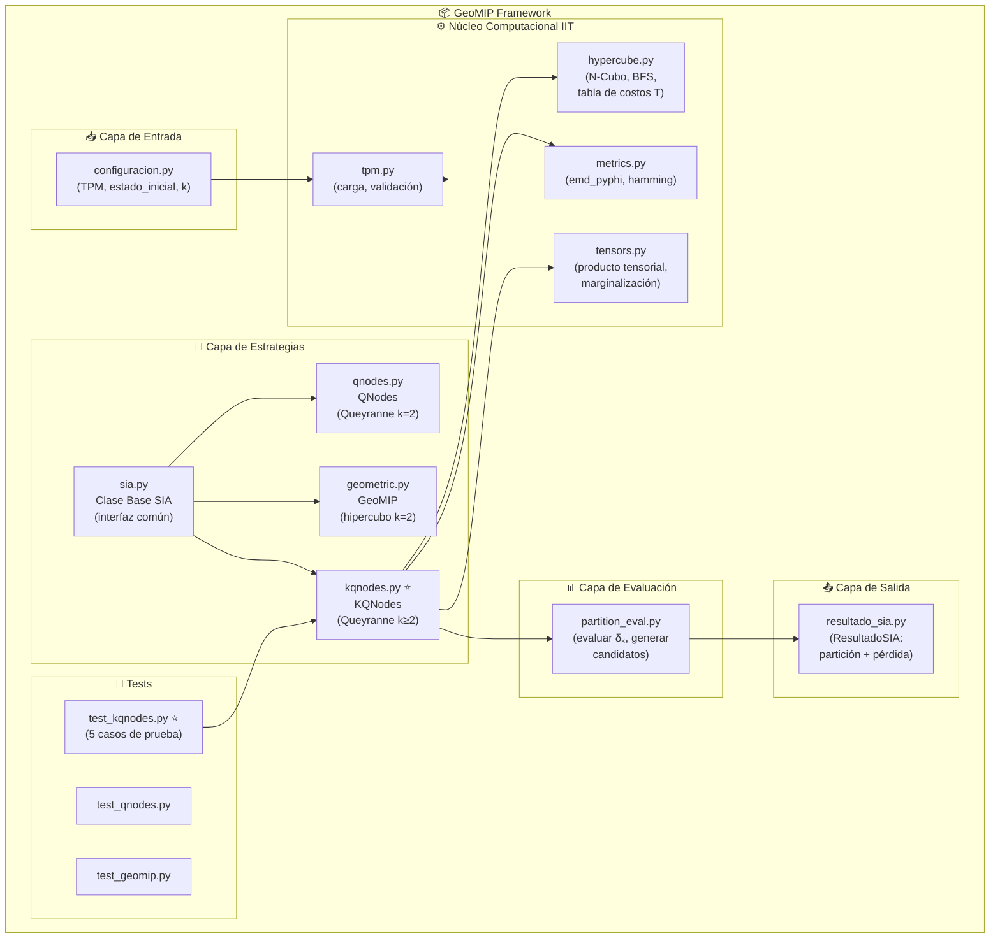
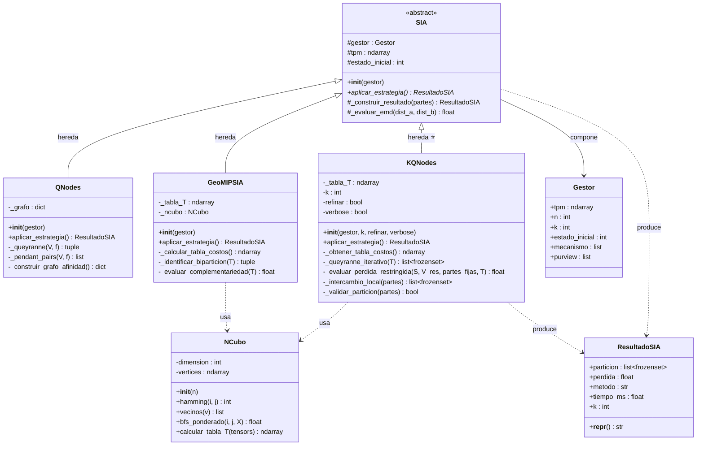
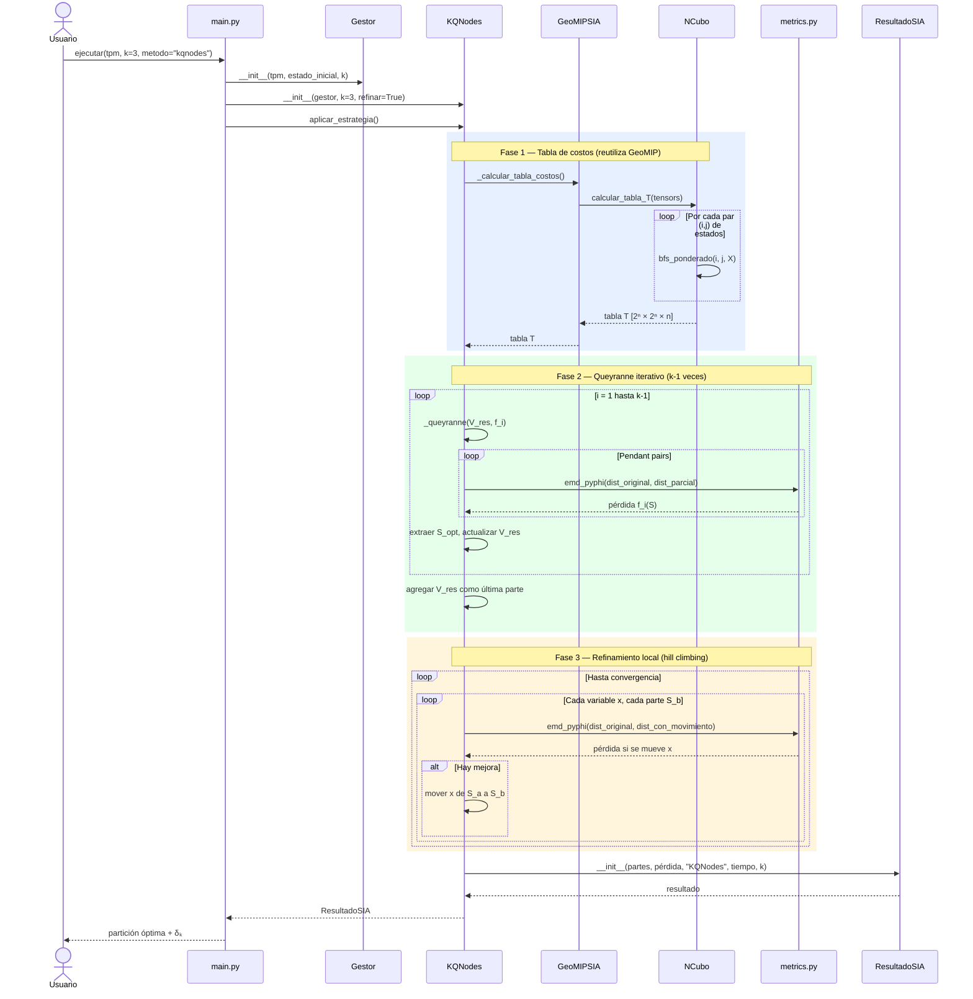

# KQNodes — Diagramas UML

> Diagramas de clases, secuencia, estados y paquetes para la implementación de KQNodes
> en el framework GeoMIP. Todos los diagramas están en sintaxis **Mermaid** y son
> renderizables directamente en GitHub, VS Code (extensión Mermaid Preview) y Notion.

---

## 1. Diagrama de Paquetes



---

## 2. Diagrama de Clases



---

## 3. Diagrama de Secuencia — Flujo principal KQNodes



---

## 4. Diagrama de Estados — Ciclo de vida de KQNodes

```mermaid
stateDiagram-v2
    [*] --> Inicializado : KQNodes.__init__()

    Inicializado --> CargandoTPM : aplicar_estrategia()

    CargandoTPM --> CalculandoTablaT : TPM válida
    CargandoTPM --> Error : TPM inválida / dimensión incorrecta

    CalculandoTablaT --> CalculandoTablaT : BFS por par (i,j) — O(n·2ⁿ)
    CalculandoTablaT --> TablaLista : Todos los pares calculados

    TablaLista --> IteracionQueyranne : Iniciar loop i=1..k-1

    state IteracionQueyranne {
        [*] --> PendantPairs
        PendantPairs --> EvaluandoOraculo : por cada par candidato
        EvaluandoOraculo --> PendantPairs : siguiente candidato
        EvaluandoOraculo --> ExtraerCorte : mejor pendant pair encontrado
        ExtraerCorte --> [*]
    }

    IteracionQueyranne --> IteracionQueyranne : i < k-1, V_res no vacío
    IteracionQueyranne --> ParticionInicial : i = k-1 completado

    ParticionInicial --> Refinando : refinar = True
    ParticionInicial --> Finalizado : refinar = False

    state Refinando {
        [*] --> PasadaCompleta
        PasadaCompleta --> EvaluandoMovimiento : para cada (x, S_b)
        EvaluandoMovimiento --> AplicandoMovimiento : pérdida mejora
        EvaluandoMovimiento --> SiguienteMovimiento : sin mejora
        AplicandoMovimiento --> SiguienteMovimiento
        SiguienteMovimiento --> PasadaCompleta : quedan movimientos
        SiguienteMovimiento --> Convergido : sin mejoras en pasada
        Convergido --> [*]
    }

    Refinando --> Finalizado : Convergencia o max_iter alcanzado

    Finalizado --> ResultadoListo : construir ResultadoSIA
    ResultadoListo --> [*]

    Error --> [*]

    note right of CalculandoTablaT : Costo: O(n·2ⁿ)\nReutilizable entre iteraciones
    note right of IteracionQueyranne : k-1 ejecuciones\nCosto: O(k·n³·eval_δ)
    note right of Refinando : Convergencia garantizada\n(pérdida no aumenta)
```

---

## 5. Notas de Implementación

### Archivos a crear / modificar

| Archivo | Acción | Descripción |
|---|---|---|
| `src/controllers/strategies/kqnodes.py` | **CREAR** | Clase KQNodes completa |
| `tests/test_kqnodes.py` | **CREAR** | 5 tests unitarios |
| `src/controllers/strategies/__init__.py` | **MODIFICAR** | Registrar KQNodes |
| `src/main.py` | **MODIFICAR** | Agregar opción `metodo="kqnodes"` |

### Dependencias internas a reutilizar

| Símbolo | Origen | Uso en KQNodes |
|---|---|---|
| `emd_pyphi` | `src/models/metrics.py` | Oráculo de Queyranne |
| `calcular_tabla_T` | `GeoMIPSIA` o `NCubo` | Fase 1 (reusar sin recalcular) |
| `_queyranne` | `QNodes` | Copiar/adaptar para V_res variable |
| `_construir_resultado` | `SIA` | Producir ResultadoSIA estándar |
| `producto_tensorial` | `src/models/tensors.py` | Calcular dist. reconstruida |

### Invariantes que KQNodes debe respetar

- La unión de todas las partes debe ser igual a V completo.
- La intersección de cualquier par de partes debe ser el conjunto vacío.
- Ninguna parte puede quedar vacía.
- Para k=2, el resultado debe coincidir con QNodes (tolerancia 1e-6 en pérdida).
- La pérdida después del refinamiento nunca puede ser mayor que antes.
