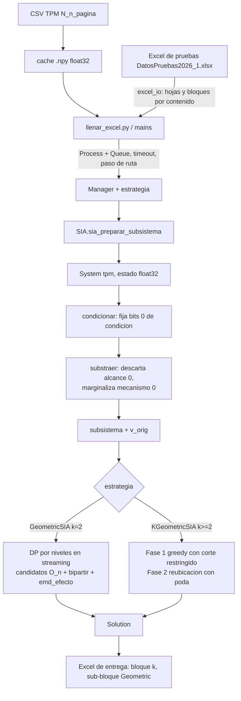
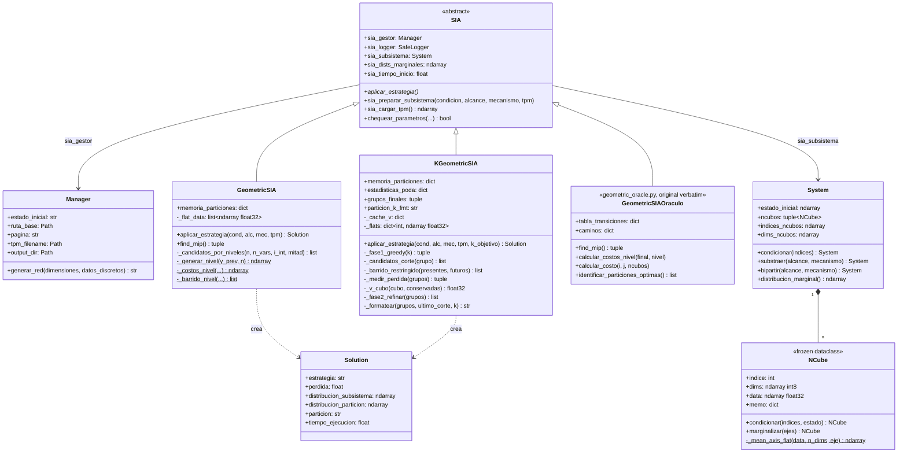

# Manual Técnico KGeoMIP

**Versión:** 3.0 (Sprint 4, validación integral y cierre). Describe el estado REAL del código a 2026-06-12.
**Ámbito:** subproyecto GeoMIP, `GeoMIP/src/Method2_Dynamic_Programming_Reformulation/` (estrategias `GeometricSIA` y `KGeometricSIA`). El subproyecto QNodes se referencia solo como contraste de convenciones y como origen del patrón de marginalización perezosa.
**Estado por sprint:** Sprint 1 (auditoría), Sprint 2 (reformulación de `GeometricSIA`), Sprint 3 (reescritura de `KGeometricSIA`) y Sprint 4 (validaciones formales, llenado del Excel de entrega y pulido) completados.

Nota sobre documentos previos: los análisis `ANALISIS_KGEOMIP.md` y `ANALISIS_COMPLEJIDAD_KGEOMIP.md` describían el diseño *previsto*, no el implementado, con afirmaciones refutadas por la lectura del código (sección 9.4); por decisión del equipo fueron eliminados y este manual es la única fuente de verdad.

## Decisiones de diseño vigentes (aprobadas por el equipo)

1. **Semántica oficial de la k-partición:** el espacio correcto es el de **vértices** $W = \{t\} \cup \{t{+}1\}$, donde la copia presente $a$ y la futura $A$ de una misma variable pueden caer en grupos distintos. El presente y el futuro son los dos tiempos del mismo sistema, no la partición; la partición es el corte resultante que se reporta junto con $\varphi$. Criterio rector y prueba de aceptación del Sprint 3 (cumplida 15/15): **k=2 reproduce exactamente a `GeometricSIA`**.
2. **Dominio de entrada:** incluye máscaras de alcance/mecanismo no triviales. El bug posicional N1 quedó corregido en el Sprint 3.
3. La versión original $O(2^n)$ de `GeometricSIA` se conserva verbatim como **oráculo de correctitud** en `controllers/strategies/geometric_oracle.py`; no debe "corregirse".
4. **Formato de salida (Sprint 4):** en el Excel de entrega la partición usa la notación de paréntesis grandes `⎛ ⎞ / ⎝ ⎠` con un par por grupo (la misma de las celdas QNodes existentes), implementada en `fmt_k_particion` y extendida a k grupos. `Solution.particion` la usa para $k \ge 3$; en $k = 2$ conserva `fmt_biparte_q` para preservar la identidad bit a bit con `GeometricSIA` (el llenador del Excel escribe la notación `⎛ ⎞` para todo k vía `particion_k_fmt`).
5. **Brecha del greedy:** el gap observado frente a fuerza bruta (sección 13.2) se acepta como limitación documentada e inherente a la heurística; el vecindario de intercambios por pares queda como trabajo futuro (sección 11), no se implementa.
6. **Ciclo de vida del TPM:** la implementación completa de P1-P4 (sección 12) es un objetivo separado. En el Sprint 4 se habilitó el **mínimo P1+P2** (caché `.npy` float32 y paso de la **ruta** al subproceso, que carga ahí el `.npy` completo) dentro del llenador del Excel, porque la hoja 25A volvía bloqueante el patrón anterior (serializar 3.2 GB por subproceso); el memmap se evaluó y se descartó (13.4-e), y el resto sigue pendiente.

---

## 1. Formalización matemática del problema

### 1.1 Sistema, TPM y n-cubos

Sea $V = \{v_0, v_1, \dots, v_{n-1}\}$ un sistema de $n$ variables binarias. La dinámica se especifica con una **matriz de transición de estados (TPM)** en representación *estado-nodo*, *row-stochastic* y *little-endian*:

$$
T \in [0,1]^{2^n \times n}, \qquad T[r, j] = P\!\left(v_j^{t+1} = 1 \;\middle|\; V^t = s(r)\right)
$$

donde la fila $r$ codifica el estado presente $s(r)$ con la convención little-endian

$$
r = \sum_{j=0}^{n-1} s_j \, 2^{j}.
$$

Cada columna $j$ de la TPM se reorganiza como un **n-cubo** (clase `NCube`): el tensor

$$
X_j \in [0,1]^{\underbrace{2 \times \cdots \times 2}_{n}}, \qquad X_j[\,s_{n-1}, \dots, s_1, s_0\,] = T[r(s), j],
$$

es decir, la función de probabilidad de activación futura del nodo $j$ vista como campo escalar sobre los $2^n$ vértices del hipercubo de estados presentes. La clase `System` agrupa los $n$ n-cubos junto con el estado inicial; la construcción es `tpm[:, i].astype(np.float32).reshape((2,)*n)` y la correspondencia entre ejes y variables se deriva en la sección 3.4.

### 1.2 Reducción a subsistema

La preparación (`SIA.sia_preparar_subsistema`) aplica dos operadores sobre el sistema completo, parametrizados por cadenas de bits donde **0 = eliminar/condicionar** y **1 = mantener**:

1. **Condicionamiento** (*background conditions*), `System.condicionar`: para cada variable condicionada $c$ se fija su valor al del estado inicial, seleccionando una cara del hipercubo. Los n-cubos cuyos índices se condicionan se descartan del alcance. Formalmente, sobre cada cubo restante:
$$
X_j' = X_j\big|_{v_c = e_c} \quad \forall c \in C.
$$

2. **Sustracción**, `System.substraer`: elimina del alcance los cubos indicados (futuro) y **marginaliza** en cada cubo restante las dimensiones de mecanismo indicadas (presente), con el operador de promedio de la sección 3.1.

El resultado es el **subsistema** $S$ con conjunto de cubos (futuros) $F \subseteq V$ y dimensiones presentes $M \subseteq V$. Se conserva su **distribución marginal de referencia**

$$
v^{\text{orig}} \in [0,1]^{|F|}, \qquad v^{\text{orig}}_j = 1 - X_j[\,e\,],
$$

donde $e$ es el estado inicial restringido a las dimensiones de $X_j$ (GeoMIP almacena la probabilidad del estado OFF; QNodes la del estado ON; ambas convenciones son internas y equivalentes para la métrica de la sección 2).

### 1.3 Espacio de particiones

**Bipartición (GeometricSIA).** El conjunto de vértices del problema es $W = \{(\mathrm{t}, m) : m \in M\} \cup \{(\mathrm{t{+}1}, f) : f \in F\}$: las copias presente y futuro son elementos *distintos*. Una bipartición es una división $W = W_1 \uplus W_2$ con ambas partes no vacías; el espacio completo tiene tamaño $2^{|W|-1} - 1$. Una bipartición puede separar la copia presente $m_j$ de la copia futura $f_j$ de una misma variable.

**k-partición (KGeometricSIA).** Partición de $W$ en $k$ bloques no vacíos. El espacio son los números de Stirling de segunda especie sobre $|W|$ elementos:

$$
S(|W|, k) = \frac{1}{k!}\sum_{i=0}^{k}(-1)^i \binom{k}{i}(k-i)^{|W|} \;\sim\; \frac{k^{|W|}}{k!}.
$$

La semántica "pegada" por nodo de la versión anterior (presente y futuro arrastrados juntos) fue eliminada en el Sprint 3 por decisión del equipo.

### 1.4 Función de pérdida $\varphi_k$

Dada una partición $\Pi = \{S_1, \dots, S_k\}$ de $W$, el sistema particionado se modela haciendo las partes causalmente independientes: cada cubo futuro $j \in S_m$ conserva únicamente las dimensiones presentes de su parte y marginaliza las demás,

$$
\tilde{X}_j = \mathcal{M}_{M \setminus \mathrm{pres}(S_m)}\!\left(X_j\right),
$$

y la distribución reconstruida, evaluada nodo a nodo bajo la métrica de la sección 2, se reduce al vector de marginales

$$
v^{\Pi}_j = 1 - \tilde{X}_j[\,e\,].
$$

La pérdida de la partición es

$$
\varphi(\Pi) = \mathrm{EMD}_{\text{efecto}}\!\left(v^{\Pi},\, v^{\text{orig}}\right) = \sum_{j \in F} \left| v^{\Pi}_j - v^{\text{orig}}_j \right|,
$$

y el problema k-MIP es $\Pi^\ast = \arg\min_{\Pi \in \mathcal{P}_k(W)} \varphi(\Pi)$. Para biparticiones, `System.bipartir` implementa exactamente $\tilde{X}_j$: los cubos del lado "alcance" conservan solo las dimensiones del mecanismo dado; los demás cubos marginalizan esas mismas dimensiones.

---

## 2. Métricas: EMD-efecto y distancia de Hamming

### 2.1 EMD-efecto y su reducción analítica (justificación formal)

La pérdida compara dos distribuciones sobre $\{0,1\}^{|F|}$: la del subsistema intacto y la reconstruida. En general la Earth Mover's Distance exige resolver un problema de transporte; aquí se reduce a una suma de diferencias marginales gracias a la estructura producto de ambos repertorios.

**Supuesto de independencia condicional.** En el marco causal del proyecto, cada nodo futuro $j$ es una variable de Bernoulli cuya probabilidad depende solo del estado presente (su fila de la TPM). Fijado el estado inicial $e$, el repertorio efecto del subsistema es el producto de sus marginales por nodo, $p = \bigotimes_j p_j$, y la reconstrucción particionada es, por construcción (sección 1.4), también un producto, $q = \bigotimes_j q_j$, con $p_j, q_j$ distribuciones sobre $\{0,1\}$.

**Proposición (reducción de la EMD con costo de Hamming).** Si $p = \bigotimes_{j} p_j$ y $q = \bigotimes_{j} q_j$ sobre $\{0,1\}^m$ y el costo de transporte es la distancia de Hamming, entonces

$$
\mathrm{EMD}(p, q) \;=\; \sum_{j=1}^{m} \mathrm{EMD}(p_j, q_j) \;=\; \sum_{j=1}^{m} \left| p_j(0) - q_j(0) \right|.
$$

*Demostración.* Sea $\gamma$ un acoplamiento cualquiera de $(p, q)$ y $(X, Y) \sim \gamma$. Como $d_H(x,y) = \sum_j \mathbf{1}[x_j \neq y_j]$, el costo esperado es $\mathbb{E}_\gamma[d_H] = \sum_j P_\gamma(X_j \neq Y_j)$. Para cada coordenada, $P(X_j \neq Y_j) \ge \mathrm{TV}(p_j, q_j)$ (ninguna probabilidad de desacuerdo puede ser menor que la distancia de variación total de las marginales acopladas), y en variables binarias $\mathrm{TV}(p_j, q_j) = |p_j(0) - q_j(0)|$. Esto da la cota inferior. Para la superior, tómese el acoplamiento producto $\gamma = \bigotimes_j \gamma_j$ con $\gamma_j$ el acoplamiento maximal por coordenada, que alcanza $P(X_j \neq Y_j) = \mathrm{TV}(p_j, q_j)$; su costo es exactamente la suma. Como además en $\{0,1\}$ la EMD con costo $d_H$ coincide con la TV, se concluye la doble igualdad. $\blacksquare$

**Consecuencias prácticas.** (i) Nunca es necesario materializar los repertorios conjuntos de tamaño $2^{|F|}$: basta el vector de marginales por nodo. (ii) La implementación es una línea: `np.sum(np.abs(u - v))` (`funcs/base.py`, `emd_efecto`). (iii) La elección de referencia OFF u ON es irrelevante: $|(1-u)-(1-v)| = |u-v|$. (iv) El supuesto que sostiene todo es la factorización de ambos repertorios; si en el futuro se introdujeran reconstrucciones no producto, la reducción deja de ser válida y debe revisarse.

### 2.2 Distancia de Hamming

Para estados $a, b \in \{0,1\}^n$, $d_H(a,b) = |\{i : a_i \neq b_i\}|$: la métrica del **retículo del hipercubo** (número mínimo de aristas entre dos vértices). En el método geométrico gobierna el factor de decaimiento $\gamma = 2^{-d_H}$ de la función de costo (sección 4). La versión reformulada trabaja con enteros y XOR, donde la distancia está implícita en el nivel del retículo; el oráculo conserva la versión original con `sum(x != y for x, y in zip(a, b))` y conversión de estados vía cadenas (hallazgo 9.2.4, resuelto en la reformulada).

### 2.3 Nota sobre el caso determinista

Cuando la TPM es binaria y el subsistema no marginaliza nada, $v^{\text{orig}}, v^{\Pi} \in \{0,1\}^{|F|}$ y la EMD-efecto coincide numéricamente con una distancia de Hamming entre vectores. En cuanto se marginaliza (promedios), los valores son fraccionarios y la identidad deja de aplicar; la fórmula general de 2.1 es la válida. Los documentos previos enunciaban la reducción a Hamming sin esta salvedad.

---

## 3. Marginalización y reconstrucción tensorial

### 3.1 El operador de marginalización

Marginalizar la dimensión $v$ de un cubo $X$ es promediar sus dos caras opuestas:

$$
\mathcal{M}_v(X)[\dots, \hat{s_v}, \dots] = \tfrac{1}{2}\left( X[\dots, s_v{=}0, \dots] + X[\dots, s_v{=}1, \dots] \right).
$$

Promedia (no suma) porque la TPM estado-nodo es una familia de probabilidades condicionales indexada por el estado presente: marginalizar el presente bajo prior uniforme equivale al promedio. Propiedades:

- **Conmutatividad / invariancia al orden:** $\mathcal{M}_a \circ \mathcal{M}_b = \mathcal{M}_b \circ \mathcal{M}_a = \mathcal{M}_{\{a,b\}}$, por linealidad del promedio por eje (integral iterada de Fubini en el caso discreto). Esto justifica que `NCube.marginalizar` reciba un conjunto de ejes sin orden.
- **Idempotencia sobre ejes ya eliminados:** el código interseca `ejes` con `dims` antes de operar.

Implementación GeoMIP vigente (desde el Sprint 2): perezosa sobre el arreglo plano con memoización (sección 3.2). La versión original usaba `np.mean(self.data, axis=ejes_locales)` *eager* y sin memoización, que materializa buffers intermedios del tamaño del cubo completo y promociona a float64, violando las restricciones de memoria para $n \ge 25$; quedó reemplazada.

### 3.2 Marginalización plana por strides

`NCube.marginalizar` opera de forma perezosa sobre el arreglo plano con memoización por tupla de ejes. Para un arreglo plano $x$ de tamaño $2^{n}$ donde la variable en la posición local $p$ (según la sección 3.4) tiene peso $2^{p}$:

$$
\mathcal{M}_p(x)[\,b \cdot 2^{p} + t\,] = \tfrac{1}{2}\left( x[\,b \cdot 2^{p+1} + t\,] + x[\,b \cdot 2^{p+1} + 2^{p} + t\,] \right),
\qquad 0 \le t < 2^{p},\; 0 \le b < 2^{n-1-p}.
$$

**Equivalencia formal con `np.mean(axis=...)`:** ambas expresiones promedian exactamente los mismos pares de índices. En la vista `reshape((2,)*n)` en orden C, el eje $a$ tiene stride $2^{n-1-a}$; el eje local del código se define $a = n_\text{dims} - 1 - p$, de donde el stride es $2^{p}$, idéntico al de la fórmula plana. Validación ejecutada (cubos 3D y 4D, todos los ejes y pares de ejes, `np.allclose(atol=10^{-6})`): OK (sección 4.8).

La implementación (`models/core/ncube.py`, `_mean_axis_flat`) es la **versión vectorizada** del patrón por bloques: el plano se ve como `(n_bloques, 2, stride)` mediante `reshape` (vista, sin copia) y las dos caras del eje se suman con `np.add(..., out=salida)` directamente sobre el único buffer nuevo, de tamaño $2^{n-1}$. Aritmética idéntica al patrón de bloques de referencia, sin el bucle Python de $n/(2 \cdot stride)$ iteraciones (que para el eje menos significativo de un cubo de $2^{25}$ serían 16.7 millones de iteraciones interpretadas). La marginalización multi-eje se realiza eje por eje (conmutatividad, sección 3.1) y el resultado por tupla de ejes queda memoizado en el cubo, de modo que biparticiones o mediciones repetidas no recalculan.

### 3.3 Reconstrucción k-partita

Con las partes independientes, la distribución conjunta reconstruida es el producto tensorial $\bigotimes_m P(S_m^{t+1} \mid S_m^{t})$. Por la proposición de 2.1 nunca es necesario materializar ese producto de tamaño $2^{|F|}$: basta el vector de marginales por nodo $v^{\Pi}$, que se obtiene cubo a cubo. `_medir_perdida` (sección 5.4) explota esta factorización con doble memoización: escalar por (cubo, dims conservadas) y por partición en clave canónica.

### 3.4 Endianness: derivación del mapeo estado -> índice plano

Era la "suposición no verificada" 2.5 del inventario inicial. Verificación analítica:

1. La fila $r$ de la TPM codifica el estado $s$ con $r = \sum_j s_j 2^j$ (little-endian, definición de las muestras).
2. `reshape((2,)*n)` en orden C asigna al eje $a$ el stride $2^{n-1-a}$. Para que `data[idx_0, ..., idx_{n-1}] = tpm[r, j]` se requiere que el eje $a$ represente a la variable $v = n-1-a$.
3. Por lo tanto `ravel()` (orden C) es la **identidad** sobre la columna original: `flat[r] = tpm[r, j]`, y el índice plano de un estado es $\sum_j s_j 2^j$, que es exactamente `int("".join(map(str, estado[::-1])), 2)` como hace el original (`geometric_oracle.py:165`; la reformulada construye el mismo entero con desplazamientos de bits).
4. Consistencia interna: `NCube.condicionar` selecciona el eje `n_dims - (v+1)` para la variable global $v$, y `NCube.marginalizar` usa `eje_local = (n_dims-1) - pos`, ambos coherentes con (2). Regla general: $\text{eje}_a = (n_\text{dims}-1) - \text{pos}(v)$ con $\text{pos}(v)$ la posición de $v$ en `dims` ordenado.

**Conclusión:** el mapeo es correcto bajo la notación por defecto (`LIL_ENDIAN`) y quedó cubierto por el test de endianness ejecutado en el Sprint 2 (sección 4.8); es un invariante frágil que cualquier cambio de notación u orden de `dims` rompería en silencio, por eso el test permanece en la batería. La rama `BIG_ENDIAN` de `System.__init__` estaba además rota y fue corregida (hallazgo N2).

---

## 4. Método geométrico de bipartición (original y reformulación del Sprint 2)

### 4.1 Función de costo sobre el retículo de Hamming

Fijado el estado inicial $i$ del subsistema, el algoritmo define el **estado final como su complemento** $j^\ast = \bar{i}$ (`geometric_oracle.py:84`), de modo que $d_H(i, j^\ast) = n$. Para cada estado $j$ alcanzado en el camino y cada cubo $c$, el costo de transición es la recursión

$$
t_c(i,j) = \gamma_{ij}\left( \left| X_c[i] - X_c[j] \right| + \sum_{p \in \mathrm{Pred}(j)} t_c(i,p) \right),
\qquad \gamma_{ij} = 2^{-d_H(i,j)},
$$

donde $\mathrm{Pred}(j) = \{ p : p = j \oplus e_b,\; b \in \mathrm{diff}(i,j) \}$ son los vecinos de $j$ un bit más cerca de $i$ (todos a distancia $d_H(i,j) - 1$). Implementación original: `calcular_costo` (`geometric_oracle.py:144-192`), que llena `tabla_transiciones[(i, j)]` nivel por nivel mediante `calcular_costos_nivel`; la reformulada evalúa la misma recursión en streaming (4.6). Importante: los sumandos $t_c(i,p)$ ya incluyen sus propios factores $\gamma_{ip}$; la recursión es sobre valores ya descontados.

### 4.2 Forma desplegada de la recursión

**Proposición.** Para $i$ fijo y todo $j$ con $d = d_H(i,j)$,

$$
t_c(i,j) \;=\; \sum_{\substack{u \,:\, i \preceq u \preceq j}} (d - d_u)! \; 2^{-\sigma(d_u, d)} \; \left| X_c[i] - X_c[u] \right|,
\qquad \sigma(e, d) = \sum_{l=e}^{d} l = \frac{(d+e)(d-e+1)}{2},
$$

donde $u \preceq j$ recorre el intervalo del retículo entre $i$ y $j$ (estados que solo difieren de $i$ en bits en los que también difiere $j$) y $d_u = d_H(i,u)$.

*Demostración (inducción sobre $d$).* Para $d=1$, $\mathrm{Pred}(j)=\{i\}$ y $t_c(i,i)=0$, luego $t_c(i,j) = 2^{-1}|X_c[i]-X_c[j]|$, que coincide con el término $u=j$ ($0! \cdot 2^{-\sigma(1,1)} = 2^{-1}$). Para el paso inductivo, el número de cadenas monótonas $u = w_e \prec w_{e+1} \prec \cdots \prec w_d = j$ es $(d-e)!$ (en cada paso se añade uno de los bits restantes), y cada nivel $l$ atravesado aporta un factor $2^{-l}$, acumulando $2^{-\sigma(e,d)}$. El término propio $u=j$ aporta $(d-d)! \, 2^{-d}$. $\blacksquare$

**Consecuencias.**

1. El costo es **separable por cubo**: $t_c$ depende solo del campo escalar $X_c$.
2. $t_c(i,j)$ es una **media ponderada del down-set** de $j$: depende de los $2^{d}$ estados del intervalo $[i,j]$. La exponencialidad está en la *definición*, no solo en la implementación.
3. Los pesos $(d-e)!\, 2^{-\sigma(e,d)}$ decaen superexponencialmente con la profundidad $d - e$. Esta observación abrió las dos rutas que el Sprint 2 evaluó formalmente: (a) **truncamiento con cota de error** explícita usando $\max_u |X_c[i]-X_c[u]| \le 1$, con error $\le \sum_{e<d-r}(d-e)!\,2^{-\sigma(e,d)}\binom{d}{e}$; y (b) **restricción del conjunto de estados** consumido por el barrido. Ambas fueron analizadas y descartadas en la sección 4.5 (el truncamiento porque su error es del mismo orden que la señal en los niveles bajos; la restricción porque el barrido consume todos los niveles $1..n{-}1$), y la salida final fue la reformulación exacta en streaming de la sección 4.6.

### 4.3 Generación y evaluación de candidatos (heurística)

`identificar_particiones_optimas` (`geometric_oracle.py:194`; en la reformulada, `_candidatos_por_niveles`) construye $O(n)$ candidatos de bipartición:

1. **Cortes unitarios de futuro:** para cada cubo $c$, la bipartición $\{c\}_{t+1}$ contra todo lo demás (el mecanismo completo queda del lado grande). Son $|F|$ candidatos.
2. **Un candidato por nivel** $1 \le \ell < \lceil (n+1)/2 \rceil$: para cada estado $j$ del nivel se definen presentes = bits donde $j$ coincide con $i$, y cada cubo $c$ se asigna al lado de menor costo entre $t_c(i,j)$ y $t_c(i,\bar{j})$ (complemento); gana el estado de menor costo agregado del nivel. Es una regla voraz por cubo, sin garantía de optimalidad.

Cada candidato se evalúa de forma **exacta** con `System.bipartir` + `emd_efecto` contra $v^{\text{orig}}$ y se devuelve el argmin (idéntico en ambas versiones). El resultado es la mejor bipartición *dentro del conjunto de candidatos*: la calidad global depende de la heurística de candidatos (la brecha frente a fuerza bruta de biparticiones se discute en la sección 13.2 para el caso k-partito; para k=2 ambas estrategias coinciden por construcción).

### 4.4 Pseudocódigo de la versión original (conservada como oráculo)

```text
find_mip():                                       # geometric_oracle.py
    caminos[0] = [estado_inicial]
    para nivel = 1 .. n:                          # n = |M|, estado final = complemento
        para cada estado del nivel anterior:
            para cada bit aún distinto del final:
                generar vecino; si no visitado en el nivel:
                    calcular_costo(i, vecino)     # tabla[(i, vecino)] = vector de |F| costos
    candidatos = identificar_particiones_optimas()  # O(n) candidatos
    para cada candidato (presentes, futuros):
        dist = bipartir(futuros, presentes).distribucion_marginal()
        memoria[clave] = (emd_efecto(dist, v_orig), dist)
    return argmin(memoria)
```

### 4.5 Análisis de las rutas de reformulación (Sprint 2)

Criterio de aceptación impuesto: **el resultado (partición y phi) debe coincidir exactamente con el oráculo.**

**(a) Restricción al conjunto de estados consumido: no reduce la asintótica.**
El barrido lee, para cada nivel $\ell \in \{1, \dots, \lceil\tfrac{n+1}{2}\rceil - 1\}$, todos los estados del nivel y sus complementos (nivel $n-\ell$). La unión de niveles consumidos es $\{1, \dots, n-1\}$ completa: **el único nivel prescindible es el $n$** (cuya entrada el original construía solo para leer su longitud, hallazgo 2.1). Eliminarlo no cambia nada asintóticamente.

**(b) Truncamiento de la recursión: no certificable para selección exacta.**
De la forma desplegada (4.2), truncar a profundidad $r$ produce un error acotado por la cola de pesos. Definiendo la cota superior $\tau(d)$ de $|t_c(i,j)|$ vía $\tau(d) = 2^{-d}(1 + d\,\tau(d{-}1))$, $\tau(1)=\tfrac12$, el error de $r=0$ es $E(d) \le 2^{-d}\, d\, \tau(d{-}1)$. Numéricamente: $\tau = 0.5,\ 0.5,\ 0.3125,\ 0.1406,\ 0.0532, \dots$, de modo que para $d=4$: $E \le 2^{-4}\cdot 4 \cdot 0.3125 = 0.078$, **mayor** que el propio término dominante $2^{-4} D \le 0.0625$. El error es del mismo orden que la señal en los niveles bajos (justo los que generan candidatos): el truncamiento no puede garantizar que el argmin por nivel se preserve. Queda documentado como alternativa aproximada con cota explícita, y rechazado como mecanismo por defecto.

**(c) Cota inferior: la exponencialidad temporal es inherente a la semántica de la heurística.**
*Proposición.* Todo algoritmo que reproduzca la selección por niveles del método geométrico debe leer $\Omega(2^n)$ valores de los cubos en el peor caso. *Esbozo adversarial:* el costo $f(j)$ de un estado $j$ depende de $D_c(j) = |X_c[i]-X_c[j]|$ a través del término dominante $2^{-d}D_c(j)$ de $t_c(i,j)$; si un algoritmo no lee $X_c[j]$ para algún $j$ de un nivel barrido, un adversario puede fijar ese valor para convertir a $j$ en el argmin estricto del nivel (o impedirlo), alterando el candidato emitido y, con datos apropiados, la partición final. Como los niveles barridos cubren $\Theta(2^n)$ estados, la cota sigue. $\blacksquare$

**Conclusión:** lo eliminable no es el tiempo exponencial sino (i) la **materialización** del retículo como estructuras de Python (espacio y constantes), (ii) el nivel $n$, y (iii) las constantes interpretadas del bucle caliente. La reformulación implementada ataca exactamente eso, con resultado idéntico al oráculo.

### 4.6 Reformulación implementada: DP por niveles en streaming

`GeometricSIA` (en `geometric.py`) reescribe el cálculo así:

1. **Estados como enteros.** Cada estado se codifica relativo al inicial: $y = j \oplus i$ (`uint32`), con la posición $p$ como bit $p$. El índice plano del cubo es $i_{\text{int}} \oplus y$ (sección 3.4); desaparecen tuplas, listas y conversión por cadenas.
2. **Un nivel = una matriz.** $T_\ell \in \mathbb{F}_{32}^{L_\ell \times |F|}$ con $L_\ell = \binom{n}{\ell}$. La recursión se evalúa vectorizada:
$$
T_\ell[y] = 2^{-\ell}\Big( D[y] + \sum_{b \,:\, y_b = 1} T_{\ell-1}[y \oplus 2^b] \Big),
$$
con agregación bit por bit ($n$ pasadas): para $b$ fijo, el mapeo $y \mapsto y \oplus 2^b$ es inyectivo, así que la suma indexada no tiene colisiones; los predecesores se localizan por búsqueda binaria sobre el nivel anterior.
3. **Mismo orden, mismos desempates.** El original recorre estados en un orden de generación concreto y resuelve empates por primera aparición (en el argmin por nivel, en el `min` final, y con `<=` favoreciendo el lado futuro cubo a cubo). `_generar_nivel` replica ese orden exactamente (producto fila-mayor + deduplicación por primera ocurrencia vía `np.unique(..., return_index=True)`), y el barrido usa `np.argmin` (primera ocurrencia del mínimo) sobre ese mismo orden: la reformulación es *bit a bit equivalente* en la selección, no solo numéricamente cercana.
4. **Streaming con liberación por pareja.** Solo se retienen el nivel anterior (para la recursión) y los niveles bajos $1..\lceil\tfrac{n+1}{2}\rceil-1$ hasta que el avance alcanza su complementario $n-\ell$; allí se ejecuta el barrido del par y el nivel bajo se libera. El nivel $n$ no se construye (su único uso era `len`, sustituido por $|F|$ directo).
5. **El barrido, vectorizado.** Con $A = T_\ell$ y $C = T_{n-\ell}[\text{filas de los complementos}]$: la elección por cubo es la máscara $A \le C$, el costo por estado es `where(máscara, A, C).sum(axis=1)` y el ganador `argmin`. Idéntico al doble bucle original.
6. **Evaluación de candidatos sin cambios**, ahora sobre n-cubos float32 con marginalización perezosa memoizada (sección 3.2).

```text
find_mip():                                        # geometric.py (reformulado)
    candidatos = cortes unitarios (orden por índice)
    y_0 = [0]; T_0 = [vector nulo]
    para nivel = 1 .. n-1:
        y_l = generar_nivel(y_{l-1})               # orden del oráculo, dedupe 1ra aparición
        T_l = 2^-l * (D(y_l) + suma_predecesores)  # matrices float32, agregación por bit
        si nivel <= mitad-1: retener (y_l, T_l)
        si n-nivel está retenido:                  # llegó el complementario
            candidatos += barrido(nivel_bajo = n-nivel, nivel_alto = l); liberar nivel bajo
    evaluar candidatos con bipartir + emd_efecto   # idéntico al oráculo
    return argmin
```

**Espacio:** el pico está dominado por los niveles bajos retenidos: $\sum_{\ell < \lceil(n+1)/2\rceil} \binom{n}{\ell} \cdot |F| \cdot 4\,\text{B} \approx 2^{n-1}\, |F| \cdot 4\,\text{B}$ en float32 contiguo (n=25: ~1.7 GB), frente a $\Theta(2^n)$ entradas de diccionario con listas de floats de Python (~1-1.5 KB por estado; decenas de GB en n=25). **Tiempo:** $\Theta(2^n \cdot n \cdot |F|)$ operaciones vectorizadas; el factor $n^2$ del original se conserva en el conteo de operaciones pero el costo por operación baja de microsegundos interpretados a nanosegundos de SIMD.

### 4.7 Precisión: float32 y desempates

Las estructuras de costo pasan a float32 (restricción de memoria del proyecto). Riesgo teórico: un casi-empate que float64 y float32 redondeen a lados distintos podría cambiar un argmin. Mitigaciones: (i) los valores $D$ son racionales diádicos (promedios de datos binarios), exactos en float32 hasta 24 bits de mantisa; (ii) la suma del barrido se acumula en float64 como el original; (iii) la batería de validación (4.8) no encontró ninguna discrepancia. Si un caso futuro divergiera por empate numérico, debe tratarse como empate legítimo (mismo phi) y documentarse.

### 4.8 Validación contra el oráculo (ejecutada)

Batería `review/sprint2/validar_oraculo.py`, 15 casos sobre N3A, N4A/B, N5A/B, N6A, N8A, N10A y N15B con máscaras triviales y no triviales ($n \le 12$ para mantener el oráculo tratable), más dos pruebas estructurales:

- **Equivalencia de marginalización** (`_mean_axis_flat` vs `reshape((2,)^n).mean(eje)`, cubos 3D y 4D, todos los ejes y pares de ejes): OK.
- **Endianness** (índice plano $= \sum_p s_p 2^p$, $n = 3,4,5$, todos los estados): OK.
- **Oráculo vs reformulada: 15/15 con partición idéntica (cadena exacta) y phi idéntico** (diferencia 0 a 6 decimales; tolerancia exigida $10^{-5}$). Los valores coinciden además con el baseline float64 capturado antes de cambiar el sustrato numérico, de modo que ni el float32 ni la marginalización perezosa alteraron el resultado.

---

## 5. Extensión a k particiones (KGeometricSIA, reescrita en el Sprint 3)

La clase fue reescrita por completo (`controllers/strategies/k_geometric.py`). La versión anterior, cuyos defectos documenta el inventario 9.3 (semántica "pegada" por nodo, ids posicionales N1, tabla en `pass`, fuerza bruta $2^{|g|-1}$, distribución mock), quedó reemplazada; el historial de git la conserva.

### 5.1 Semántica y representación

La k-partición se define sobre el espacio de **vértices** $W$: los grupos son `frozenset` de pares `(tiempo, etiqueta)`, donde la etiqueta es la variable global (`cube.indice` / valores de `cube.dims`), nunca una posición. Esto corrige el bug N1 por construcción. Dada la partición $\{S_1..S_k\}$, cada cubo futuro $f \in S_m$ conserva exactamente las dimensiones presentes de $S_m$ (sección 1.4); con dos grupos esta reconstrucción coincide operación por operación con `System.bipartir` (mismos ejes de marginalización, mismas claves de memo de `NCube`, misma selección del estado y misma EMD), que es la base de la prueba de aceptación k=2.

### 5.2 Fase 1: greedy top-down con el corte geométrico restringido

```text
grupos = [W]
mientras len(grupos) < k:
    para cada grupo G con |G| >= 2 (en orden):
        para cada candidato (G1, G2) de _candidatos_corte(G):   # orden de GeometricSIA
            phi = _medir_perdida(grupos con G reemplazado por G1, G2)   # GLOBAL y exacta
    aplicar el corte de phi mínimo (estricto <, gana el primero)        # voraz
```

`_candidatos_corte(G)` reúsa el generador reformulado del Sprint 2 restringido al grupo: cortes unitarios de futuro (etiqueta ascendente) y un ganador por nivel del **sub-retículo** de las dimensiones presentes de $G$ (DP en streaming sobre $2^{|P_G|}$ estados, con el bit $b$ mapeado a la posición global de la etiqueta $P_G[b]$). Con $G = W$ (único grupo, caso k=2) los candidatos, su orden, la evaluación y los desempates son **idénticos** a `GeometricSIA`: el bypass k=2 devuelve el mismo resultado bit a bit y la fase 2 no se ejecuta.

Dos propiedades que corrigen N7: cada candidato se evalúa sobre la **partición global** resultante (ningún cubo queda "fuera de todo grupo" marginalizado de más), y la elección del grupo a partir sale de esa misma medición global.

### 5.3 Fase 2 (solo k >= 3): reubicación de vértices con poda

```text
mientras una pasada produzca mejora:                     # sin reinicio
    para cada vértice w (orden canónico):
        para cada grupo destino:
            si (w, destino) ya revisado con las mismas versiones de origen/destino: saltar
            cota = suma de |v_f - v_orig_f| de los cubos afectados
            si cota == 0: podar (ninguna mejora posible)
            evaluar Delta cubo a cubo con aborto temprano:
                si Delta_parcial - restante >= 0: podar (cota inferior no negativa)
            si Delta < 0: aplicar, subir versiones de origen y destino, seguir con el
                          SIGUIENTE vértice (first-improvement, sin reinicio global)
```

Cubos afectados: si $w$ es un futuro, solo su cubo; si es un presente, los futuros de los grupos origen y destino. Las cotas son seguras: todo delta nuevo es $\ge 0$, luego la mejora de un movimiento no puede exceder la suma de las pérdidas actuales de los cubos afectados, y la cota inferior parcial $\Delta_{\text{parcial}} - \sum_{\text{restantes}} \delta_f$ nunca poda un movimiento mejorante. La terminación está garantizada: cada movimiento aceptado decrece $\varphi$ estrictamente y el espacio de particiones es finito. Los contadores de versión por grupo eliminan el reinicio: un par (vértice, destino) descartado solo se reevalúa si cambió la composición de su origen o de su destino.

Efecto medido de la poda (`review/sprint3/kgeo_nuevo.json`): en todos los casos la fase 2 convergió en 1 pasada; la poda por cota cero descartó una fracción importante de los movimientos candidatos sin evaluarlos (por ejemplo 16 de 36 en N10A k=3) y el aborto temprano cortó **todas** las evaluaciones restantes, de modo que ningún movimiento llegó a aplicarse (`movimientos: 0` en toda la batería). En esta batería la fase 2 no encontró mejoras (el greedy ya era óptimo local de reubicación), consistente con los dos casos de gap de la sección 13.2.

### 5.4 Medición de pérdida y memoización

`_medir_perdida(grupos)`: $O(|F|)$ consultas a la caché escalar `(cubo, dims conservadas)`, apoyada en la memoización de `NCube.marginalizar`; la primera vez que aparece un par cuesta una cadena de promedios por strides, las siguientes son un lookup. La pérdida por partición se memoiza con **clave canónica** (tuplas internas ordenadas y ordenadas entre sí), lo que resuelve el hallazgo 3.4. La distribución reconstruida de la mejor partición se devuelve en `Solution.distribucion_particion` (el mock 3.6 quedó eliminado).

### 5.5 Validación ejecutada (Sprints 3-4)

- **Aceptación k=2 (no negociable): 15/15 OK.** Misma batería del Sprint 2: partición idéntica (cadena exacta) y phi idéntico contra `GeometricSIA` (`review/sprint3/validar_kgeo.py`). La versión anterior fallaba este criterio (ej. N5A: phi 0.5 vs 0.0; N10A: 1.465 vs 0.4727).
- **k>=3 contra fuerza bruta exacta** (mismo espacio de vértices, misma función de pérdida, enumeración completa): óptimo alcanzado en **7/9** casos; **gap absoluto 0.25** en N3A k=3 y N4A k=3. Detalle en la sección 13.2.
- **Monotonía y invariancia dimensional:** ejecutadas en el Sprint 4 con resultado favorable completo; detalle en la sección 13.1.

### 5.6 Formato de salida

`Solution.particion` usa `fmt_biparte_q` en k=2 (identidad con `GeometricSIA`) y la notación de paréntesis grandes `fmt_k_particion` para $k \ge 3$. El atributo `particion_k_fmt` expone la notación `⎛ ⎞` para todo k: un par `⎛alcance⎞`/`⎝mecanismo⎠` por grupo, grupos ordenados por tamaño y contenido (el más pequeño primero, como en las celdas QNodes del Excel), ancho centrado `max(|purv|,|mech|)+2` y `∅` para lados vacíos. Ejemplo (N10A, caso 1, k=2):

```text
⎛ I ⎞⎛  A,B,C,D,E,F,G,H,J  ⎞
⎝ ∅ ⎠⎝ a,b,c,d,e,f,g,h,i,j ⎠
```

### 5.7 Evolución del diseño: plan original vs. implementación final

Esta subsección documenta cómo evolucionó `KGeometricSIA` desde el diseño previsto por el equipo hasta lo efectivamente implementado y validado, y **por qué** cada decisión. Es relevante para la sustentación porque varias piezas del plan original no sobrevivieron al contacto con las restricciones de memoria y correctitud, y el cambio se hizo con justificación, no por capricho.

Nota de procedencia: los detalles del **plan original** (factor de decrecimiento exponencial elegido sobre alternativas lineal/logarítmica; la idea de una "tabla topológica bottom-up"; la Fase 2 concebida como "programación dinámica de fronteras") provienen del **conocimiento del equipo de diseño**; no figuran como documento en el repositorio (los `ANALISIS_*.md` que los mencionaban fueron eliminados por contener afirmaciones refutadas, sección 9.4). Lo que sí está en el repositorio y se verifica es el **estado final** (código + validaciones).

**Qué se conservó.**
- *Estructura greedy top-down (Fase 1).* La idea de construir la k-partición con k−1 cortes sucesivos, partiendo del sistema entero, se conservó tal cual (sección 5.2). Es fiel a la topología del método: cada corte es una bipartición geométrica.
- *Factor de decrecimiento exponencial $2^{-d}$.* El plan contemplaba tres familias de decaimiento con la distancia de Hamming: lineal ($\sim 1/d$), logarítmica ($\sim 1/\log d$) y exponencial ($2^{-d}$). Se conservó la **exponencial** y se descartaron las otras dos: el decaimiento debe reflejar que la probabilidad de una transición directa entre dos estados cae multiplicativamente con cada bit de diferencia (cada bit es un evento independiente), lo que es intrínsecamente exponencial; un decaimiento lineal o logarítmico daría peso excesivo a estados topológicamente lejanos y distorsionaría la inercia causal. El $2^{-d}$ es además el que hace que la recursión de costos tenga la forma cerrada demostrada en la sección 4.2.

**Qué se transformó (misma idea, otra realización).**
- *Tabla topológica materializada → cómputo en streaming por niveles.* El plan original construía una **tabla de costos del retículo completa**, llenada bottom-up (de los estados cercanos al inicial hacia el final). Esa tabla materializada es exactamente lo que causaba el MemoryError: un diccionario de Python con $2^n$ claves (decenas de GB en N=25, sección 1). La transformación del Sprint 2 (sección 4.6) **conservó la dirección bottom-up por niveles** pero dejó de **persistir** el retículo: cada nivel se calcula como una matriz `numpy`, se usa contra su nivel complementario y se descarta. El cálculo es bit a bit idéntico al de la tabla completa (validado contra el oráculo, 15/15), pero el pico de memoria pasó de $\Theta(2^n)$ objetos Python a $\sim 2^{n-1}$ float32 en streaming. Es la misma matemática, distinta gestión de memoria.

**Qué se reemplazó (rediseño con otra técnica).**
- *"Programación dinámica de fronteras" → búsqueda local con poda Branch & Bound.* El plan describía la Fase 2 de refinamiento como una "DP de fronteras". En el código heredado esa fase estaba **rota**: reiniciaba el barrido completo tras cada mejora y no tenía poda, lo que la volvía inviable y sin garantía de terminación (sección 9.3, hallazgo 3.5). Se **reemplazó** por una búsqueda local de reubicación de vértices con poda estilo **Branch & Bound** (sección 5.3). *Por qué B&B y no la DP original:* una DP genuina requiere subproblemas con subestructura óptima y solapamiento que se puedan tabular; el refinamiento de fronteras no tiene esa estructura (mover un vértice cambia el costo de forma no separable respecto de otros movimientos), así que no hay una tabla DP natural que explotar. En cambio, el problema **sí** admite cotas baratas y seguras (la mejora de un movimiento no puede exceder la pérdida actual de los cubos afectados; la cota inferior parcial nunca poda un movimiento mejorante), que es justo lo que Branch & Bound aprovecha para descartar movimientos sin evaluarlos. El resultado es una Fase 2 que termina (cada movimiento aceptado decrece $\varphi$ estrictamente) y que en la práctica descarta los movimientos candidatos entre la cota cero y el aborto temprano sin completar evaluaciones (sección 5.3).
- *Hallazgo empírico sobre la Fase 2:* en toda la batería medida, la Fase 2 **no encontró ninguna mejora** (`review/sprint3/*.json`, `kgeo_nuevo.json`: `movimientos: 0` en todos los casos): el greedy de la Fase 1 ya alcanzaba un óptimo local de reubicación. Esto no invalida la Fase 2 (sigue siendo la red de seguridad correcta y barata), pero es honesto documentar que, en estos datos, el refinamiento no cambió el resultado. La brecha que **sí** queda (gap de 0.25 en 2/9 casos frente a fuerza bruta, sección 13.2) es de un tipo que la reubicación de un solo vértice no puede cerrar; cerrarla requeriría un vecindario de intercambios por pares (trabajo futuro, sección 11).

**Tabla resumen.**

| Componente | Plan original (conocimiento del equipo) | Estado final (implementado y validado) |
|---|---|---|
| Estructura de la k-partición | Greedy top-down, k−1 cortes | **Conservado** (5.2) |
| Decaimiento por distancia | Elegido exponencial $2^{-d}$ sobre lineal/logarítmico | **Conservado** (4.1-4.2); descartadas lineal y logarítmica por no reflejar independencia por bit |
| Costos del retículo | Tabla topológica completa, bottom-up | **Transformado** a streaming por niveles (4.6): misma dirección y matemática, sin persistir el retículo; resuelve el MemoryError |
| Refinamiento (Fase 2) | "Programación dinámica de fronteras" (en código heredado: rota, con reinicio, sin poda) | **Reemplazado** por búsqueda local con poda Branch & Bound (5.3); termina y descarta los candidatos por cota cero + aborto temprano. En la batería no halló mejoras (greedy ya óptimo local, `movimientos: 0`) |
| Formato de salida | (no especificado) | Notación `⎛ ⎞` para todo k (`fmt_k_particion`, 5.6) |

---

## 6. Pipeline de extremo a extremo

1. **Entrada CSV** en `data/samples/N{n}{página}.csv` (también `src/.samples/`, `.samples/`; override `GEOMIP_SAMPLES_DIR`). Filas = estados presentes (little-endian), columnas = probabilidad de activación por nodo futuro. El llenador del Excel mantiene además un caché binario `.npy` float32 junto al CSV (sección 12).
2. **Manager** (`controllers/manager.py`): resuelve la ruta del CSV según la longitud del estado inicial y `aplicacion.pagina_sample_network`; expone `output_dir`.
3. **Construcción**: `System(tpm, estado_inicial)` crea los $n$ `NCube` en float32.
4. **Reducción**: `sia_preparar_subsistema(condición, alcance, mecanismo, tpm)` aplica `condicionar` y `substraer`; guarda `sia_dists_marginales` y arranca el cronómetro.
5. **Estrategia**: `GeometricSIA.aplicar_estrategia(...)` o `KGeometricSIA.aplicar_estrategia(..., k_objetivo)`; ambas decoradas con `@profile` (etiquetas `Geometric_analysis` y `K-Geometric_analysis`).
6. **Salida**: `Solution` (pérdida, partición formateada, distribuciones, tiempo). Tres consumidores: los `main` históricos (`src/main.py`, `src/mainKGeometric.py`, exportan a sus Excel de resultados) y el **llenador del Excel de entrega** (`llenar_excel.py` + `src/funcs/excel_io.py`), que localiza hojas y bloques por contenido (corrección N11), ejecuta cada caso en un subproceso con timeout y ruta+memmap del TPM, y escribe (Partición, Pérdida, Tiempo) con el formato de la hoja, de forma reanudable y con guardado atómico.

`exec.py` activa el profiler e importa `iniciar()` de `src.main`; para el llenado de la entrega se usa `llenar_excel.py` directamente.



---

## 7. Diagramas de clases

### 7.1 UML del subproyecto GeoMIP (verificado contra el código final)



Módulos auxiliares del Sprint 4 (fuera del núcleo de clases): `funcs/format.py` (`fmt_biparte_q`, `fmt_k_particion`), `funcs/excel_io.py` (localización robusta de hojas/bloques, lectura de casos, escritura de tripletas) y `llenar_excel.py` (orquestador por subprocesos con caché `.npy` + memmap).

### 7.2 Regla cero: convenciones por subproyecto (verificadas en código)

Ambas estrategias geométricas extienden la `SIA` de **GeoMIP**; ninguna debe migrarse a la convención QNodes.

| Aspecto | GeoMIP (Method2) | QNodes |
|---|---|---|
| `SIA.__init__` | `(self, gestor: Manager)` | `(self, tpm: np.ndarray)` |
| `sia_preparar_subsistema` | `(condicion, alcance, mecanismo, tpm)` | `(estado_inicial, condicion, alcance, mecanismo)` |
| `emd_efecto` | `src.funcs.base` | `src.funcs.iit` |
| Constantes de tiempo | `EFECTO` / `ACTUAL` | `EFFECT` / `ACTUAL` |
| Formato bipartición | `fmt_biparte_q` (`src.funcs.format`) | `fmt_biparticion_q` |
| Gestor de perfilado | `profiler_manager` | `gestor_perfilado` |
| Estrategias en | `src/controllers/strategies/` | `src/strategies/` |
| Carga de TPM | `genfromtxt` en mains; `.npy` + memmap en `llenar_excel.py` | `Manager.cargar_red` con `.npy` memmap y fallback por chunks |
| `NCube.marginalizar` | perezosa `_mean_axis_flat` plana + memo (desde Sprint 2) | perezosa `_mean_axis_flat` plana + memo |
| `System.bipartir` | sin memo (los cubos memoizan) | memo por `(alcance, mecanismo)` |
| `distribucion_marginal` | devuelve $1 - p$ (estado OFF) | devuelve $p$ (estado ON) |

---

## 8. Análisis de complejidad (antes y después)

Notación: $n$ = variables del subsistema (mecanismo), $|F|$ = cubos futuros (asumimos $|F| = \Theta(n)$), $k$ = partes, $P$ = pasadas de la fase 2.

### 8.1 Tabla teórica

| Componente | Tiempo antes | Espacio antes | Tiempo después | Espacio después |
|---|---|---|---|---|
| Preparación del subsistema | $O(n \cdot 2^n)$ float64 eager | picos $O(2^n)$ float64 | $O(n \cdot 2^n)$ perezoso float32 memoizado | buffers de a lo sumo $2^{n-1}$ float32 |
| GeometricSIA: costos del retículo | $\Theta(2^n n^2)$ interpretado (dict + listas) | $\Theta(2^n \cdot n)$ en objetos Python (~1-1.5 KB/estado) | $\Theta(2^n \cdot n \cdot |F|)$ ops **vectorizadas** (cota inferior $\Omega(2^n)$ demostrada en 4.5c) | $\approx 2^{n-1} |F| \cdot 4$ B float32 en streaming (n=25: ~1.7 GB vs decenas de GB) |
| GeometricSIA: candidatos | $O(n^2 \cdot 2^n)$ | $O(n^2)$ | igual, con marginalización memoizada | igual |
| KGeoMIP Fase 1 | $O(k\, n\, 2^{2n-1})$ (fuerza bruta por grupo) | memo de configs | $O\big(\sum_{\text{cortes}} 2^{p_G} p_G |F_G|\big) + O(k \cdot n)$ evaluaciones globales $O(|F|)$ memoizadas; dominado por el primer corte $= \Theta(2^n n |F|)$, los siguientes sobre sub-retículos exponencialmente menores | streaming por nivel del sub-retículo activo |
| KGeoMIP Fase 2 | $O(P n k \cdot n 2^n)$, $P$ sin cota, con reinicio | ídem | por pasada $O(n_W k)$ movimientos, cada uno $O(|F_{\text{afectados}}|)$ lookups con aborto temprano; sin reinicio (versiones por grupo); pasadas acotadas por la cadena estrictamente decreciente de $\varphi$ (1 pasada en toda la batería medida) | cachés escalares $O(\#\text{pares (cubo, conservadas)})$ |
| Reconstrucción k-partita | $O(n)$ dado el cubo marginalizado | $O(n)$ | igual | igual |

Notas históricas que el manual conserva por exigencia académica: (i) la cota temporal del original es $\Theta(2^n n^2)$, no $O(2^n n)$, por la acumulación de predecesores ($\sum_j d_H(i,j) = \tfrac{n}{2}2^n$); (ii) la complejidad $O(k n 2^n)$ que declaraban los documentos eliminados presuponía una tabla $O(1)$ que nunca existió; la fase 1 de la versión previa al Sprint 3 era $O(k\, n\, 2^{2n-1})$.

### 8.2 Mediciones de GeometricSIA (misma máquina de 15.7 GB)

Artefactos reproducibles en `review/sprint2/`: `bench_baseline.py`/`baseline.json` (capturado ANTES de tocar el código), `bench_optimizado.py`/`optimizado.json` y `optimizado_n25.json`, `validar_oraculo.py`/`validacion_oraculo.json`, `diag_tpm.py`/`diag_tpm.json`. Perfiles pyinstrument vía `@profile` en `review/profiling/`.

Partición y phi idénticos entre versiones en todos los casos comparables (4.8). Memoria = pico `tracemalloc` de la estrategia (excluye la TPM).

| Caso | Original: tiempo | Original: memoria | Reformulada: tiempo | Reformulada: memoria | Aceleración |
|---|---|---|---|---|---|
| n=5 (N5A) | 0.0036 s | 0.033 MB | 0.0035 s | 0.030 MB | 1x (ruido) |
| n=9, mec. reducido (N10A) | 0.034 s | 0.39 MB | 0.010 s | 0.10 MB | 3.4x |
| n=10 (N10A) | 0.048 s | 0.73 MB | 0.053 s | 0.09 MB | ~1x (cruce ~n=10-12) |
| n=12, mec. reducido (N15B) | 0.224 s | 4.43 MB | 0.034 s | 0.65 MB | 6.7x |
| n=15 (N15B) | 2.365 s | 40.3 MB | 0.181 s | 2.84 MB | 13.1x |
| n=20 (N20A) | 129.4 s (medido; phi idéntico, tabla de 2^20 entradas) | ~1.7 GB (modelo 40.3 MB x 2^5 x 20/15; WS del proceso muestreado >= 1.55 GB) | 11.29 s | 106 MB | 11.5x tiempo, ~16x memoria |
| n=25 (N25A) | inviable: tabla ~40-50 GB, tiempo proyectado >> horas | MemoryError | **395.6 s** | sin MemoryError; working set del proceso ~6 GB pico (incluye TPM y cubos float32) | habilitado |

Observaciones: (i) por debajo de $n \approx 10$ el costo fijo de los pases numpy iguala al original; la ganancia crece con $n$ sobre la misma asintótica $\Theta(2^n)$; (ii) la serie de la reformulada 0.181 s -> 11.3 s -> 395.6 s (n=15 -> 20 -> 25) escala con factores observados 62x y 35x frente al 32x teórico de $2^n$ por cada 5 bits, y la del oráculo 2.37 s -> 129.4 s (54.7x) muestra el mismo régimen con constante ~12x mayor; (iii) la ganancia decisiva es de **memoria**: float32 contiguo en streaming (~16x menos a n=20) hace viable n=25 completo en 16 GB; (iv) en n=25 el límite práctico ya no es la estrategia sino la carga del CSV de 1.6 GB, lo que motivó la sección 12.

### 8.3 Mediciones de KGeometricSIA (`review/sprint3/*.json`)

Antes = versión previa al Sprint 3 (sus phi no son comparables: medía una pérdida incorrecta). Después = versión reescrita.

| Caso | Antes: tiempo / memoria | Después: tiempo / memoria | phi (después) |
|---|---|---|---|
| N10A k=2 | 1.79 s / 4.76 MB (phi 1.465, NO coincidía con GeometricSIA) | 0.039 s / 0.13 MB (phi 0.4727 = GeometricSIA, bit a bit) | 0.4727 |
| N10A k=3 | 2.24 s / 4.65 MB | 0.055 s / 0.16 MB (**41x / 29x**) | 0.9531 |
| N10A k=4 | - | 0.060 s / 0.16 MB | 1.4336 |
| N10A k=5 | - | 0.077 s / 0.16 MB | 1.9180 |
| N10A k=3, mecanismo reducido | 0.96 s (resultado erróneo por N1) | 0.041 s / 0.13 MB | 0.0107 |
| N15B k=2 / k=3 / k=4 | - | 0.139 / 0.240 / 0.355 s, ~3 MB | 0.4962 / 0.9931 / 1.4908 |
| N20A k=3 | inviable en la práctica | 11.1 s (apenas más que GeometricSIA k=2 solo: 11.3 s) | 0.9983 |

El crecimiento con $k$ es sublineal en estas redes (el primer corte domina; los sub-retículos siguientes son exponencialmente menores y las evaluaciones globales reúsan las cachés por cubo). Perfil pyinstrument del caso N15B k=3 en `review/profiling/NET15A/11_06_2026/`.

---

## 9. Inventario verificado de problemas (auditoría del Sprint 1 con estados finales)

Cada ítem indica archivo:línea, estado de verificación e impacto. Rutas relativas a `GeoMIP/src/Method2_Dynamic_Programming_Reformulation/`.

**Actualización Sprint 2:** los hallazgos 1.1-1.3 y 2.1-2.4 quedan **resueltos en la versión reformulada** de `GeometricSIA`. Las referencias archivo:línea de 9.1-9.2 apuntan a `geometric_oracle.py`, que conserva el comportamiento original **a propósito** (oráculo de correctitud).

**Actualización Sprint 3:** los hallazgos de `KGeometricSIA` (9.3) y los nuevos N1, N4, N6 y N7 (9.5) quedan **resueltos por la reescritura completa** de `k_geometric.py`; las referencias de 9.3 describen la versión anterior, conservada solo en el historial de git.

**Actualización Sprint 4:** N11 corregido (`excel_io.py`); N8 mitigado en el llenador (P1+P2 mínimos); N9 sigue siendo una limitación menor de `exec.py`.

### 9.1 Hallazgo raíz (sección 1 del CLAUDE.md)

| # | Hallazgo | Estado | Evidencia |
|---|---|---|---|
| 1.1 | `find_mip` fija `estado_final = 1 - estado_inicial`, forzando $d_H = n$ y la enumeración de los $2^n$ estados del hipercubo | CONFIRMADO; resuelto en la reformulada (streaming) | `geometric_oracle.py:84, 110-113` |
| 1.2 | Tiempo | CONFIRMADO y REFINADO a $\Theta(2^n n^2)$ | acumulación de predecesores `geometric_oracle.py:177-185` |
| 1.3 | Espacio $\Theta(2^n \cdot n)$ por `tabla_transiciones` y `caminos` | CONFIRMADO; resuelto en la reformulada | `geometric_oracle.py:110-111, 131, 140, 158, 173` |

### 9.2 GeometricSIA original (sección 2 del CLAUDE.md)

| # | Hallazgo | Estado | Detalle |
|---|---|---|---|
| 2.1 | Lectura de `tabla[(i, final)]` solo para `len(costos)` | CONFIRMADO con matiz; resuelto | el barrido sí consume la tabla (estados hasta $\lceil n/2 \rceil$ y complementos); lo estrictamente gratuito era la entrada del nivel $n$. La reformulada usa $|F|$ directo y no construye el nivel $n$ |
| 2.2 | Barrido hasta `mitad` más complementos cubre el hipercubo | CONFIRMADO y PRECISADO | consumo = todos los niveles $1..n{-}1$ (sección 4.5a) |
| 2.3 | Reformulación de costos como tarea matemática central | RESUELTO | forma desplegada (4.2), análisis de rutas (4.5), reformulación exacta validada (4.6-4.8) |
| 2.4a | Conversión bit->int vía cadenas en camino caliente | CONFIRMADO; resuelto (bitwise) | `geometric_oracle.py:165-166` |
| 2.4b | Imports muertos (`heapq`, `ThreadPoolExecutor`, `itertools`) | CONFIRMADO; sin imports muertos en la reformulada | `geometric_oracle.py:1, 27, 28` |
| 2.4c | Parámetro `ncubos` de `calcular_costo` "ignorado" | MATIZADO | se usa en la acumulación (`geometric_oracle.py:184-185`) pero es redundante; además inicialización muerta `[None]*` y chequeo imposible de `None` |
| 2.4d | Bloques comentados y estructuras float64 | CONFIRMADO; resuelto | float32 en cubos y costos desde el Sprint 2 |
| 2.4e | Hamming $O(n)$ interpretado en vez de popcount | CONFIRMADO; resuelto (XOR implícito por nivel) | `geometric_oracle.py:267` |
| 2.5a | Endianness no verificado | RESUELTO | derivación 3.4 + test ejecutado (4.8) |
| 2.5b | Candidatos heurísticos sin garantía de MIP global | CONFIRMADO; acotado empíricamente para k-partición (13.2) | sección 4.3 |

### 9.3 KGeometricSIA anterior (sección 3 del CLAUDE.md; todo resuelto por la reescritura)

| # | Hallazgo | Estado |
|---|---|---|
| 3.1 | `_precalcular_tabla_topologica` terminaba en `pass`; `_flat_data` muerto | RESUELTO: el costo topológico es el DP en streaming de `_barrido_restringido` |
| 3.2 | `_encontrar_mejor_biparticion` por fuerza bruta $2^{|g|-1}$ | RESUELTO: corte geométrico reformulado restringido al grupo |
| 3.3 | `_medir_perdida` re-marginalizaba desde cero | RESUELTO: doble memoización (cubo y partición) |
| 3.4 | Clave de memoización no canónica | RESUELTO: tuplas internas ordenadas y ordenadas entre sí |
| 3.5 | Fase 2 con reinicio total y sin poda | RESUELTO: first-improvement sin reinicio + podas seguras (5.3) |
| 3.6 | `distribucion_particion` mock | RESUELTO: distribución real en `Solution` |
| 3.7 | k=2 no reproducía a `GeometricSIA` | RESUELTO: 15/15 exacto (5.5) |

### 9.4 Afirmaciones de documentos previos refutadas por el código

| Afirmación (documentos eliminados) | Realidad verificada |
|---|---|
| "La tabla de costos topológicos se precalcula y se reutiliza con consultas O(1)" | no existía: `pass`; la fuerza bruta no consultaba tabla alguna |
| "Complejidad efectiva O(k n 2^n)" | era $O(k\, n\, 2^{2n-1})$ por fuerza bruta + re-marginalización |
| "Código funcional operativo al 100%" | distribución mock, bug posicional N1, IndexError latente N4 |
| "Fase 2 = refinamiento por programación dinámica de fronteras" | era búsqueda local con reinicio; sin DP ni noción de frontera |
| "EMD se reduce a distancia de Hamming" (sin salvedad) | solo en el caso totalmente determinista sin marginalizaciones (2.3) |

### 9.5 Hallazgos nuevos de la auditoría (con estado final)

| # | Hallazgo | Estado final |
|---|---|---|
| N1 | Desalineación posición vs etiqueta en KGeometricSIA (particiones posicionales comparadas contra etiquetas reales; erróneo con máscaras no triviales) | CORREGIDO (Sprint 3): todo por etiqueta global; grupos = frozensets de (tiempo, etiqueta) |
| N2 | Rama `BIG_ENDIAN` de `System.__init__` pasaba una fila de la TPM en lugar de `n_nodes` a `reindexar` | CORREGIDO (Sprint 2) |
| N3 | `print()` de depuración dentro de `NCube.condicionar` | CORREGIDO (Sprint 2) |
| N4 | IndexError latente en fase 2 si el greedy rompía antes de k grupos | CORREGIDO (Sprint 3) |
| N5 | `Solution.__str__` lanza síntesis de voz (pyttsx3) por defecto al imprimir | VIGENTE (baja; los runners no imprimen el objeto) |
| N6 | Imports dentro de bucles calientes en KGeometricSIA | CORREGIDO (Sprint 3) |
| N7 | "Pérdida local" que marginalizaba de más y sesgaba qué grupo partir | CORREGIDO (Sprint 3): evaluación siempre global |
| N8 | Mains cargan TPM con `genfromtxt` float64 y la serializan por `multiprocessing` | MITIGADO (Sprint 4) en `llenar_excel.py` (caché `.npy` + ruta + memmap); los mains históricos conservan su patrón (P1-P4 completos = objetivo separado, sección 12) |
| N9 | `exec.py` solo invoca `src.main` | VIGENTE (baja) |
| N10 | `GeometricSIA.memoria_particiones` retiene la distribución de todos los candidatos | VIGENTE (baja; $O(n)$ candidatos) |
| N11 | Lectura/escritura del Excel con índices y rangos fijos frágiles | CORREGIDO (Sprint 4): `funcs/excel_io.py` localiza hojas, bloques por k y sub-bloques de estrategia por contenido, tolerando espacios y acentos en los rótulos |
| N12 | `sia_cargar_tpm` usa `genfromtxt` (ruta alternativa comentada) | VIGENTE (baja) |

---

## 10. Plan de validación (estado final)

1. **Oráculo k=2:** EJECUTADA (Sprint 3): **15/15** con partición y phi idénticos, máscaras triviales y no triviales.
2. **Equivalencia de la reformulación** ($n \le 12$, partición y phi): EJECUTADA (Sprint 2), 15/15 OK.
3. **Monotonía causal** $\varphi_2 \le \varphi_3 \le \varphi_4 \le \varphi_5$: EJECUTADA (Sprint 4), **9/9 OK** (sección 13.1).
4. **Invariancia dimensional:** EJECUTADA (Sprint 4), **5 casos x 2 permutaciones: phi y composición invariantes** (sección 13.1).
5. **Equivalencia de marginalización:** EJECUTADA, OK (4.8).
6. **Endianness:** EJECUTADA, OK (4.8).
7. **Memoria/estrés con $N \ge 25$:** EJECUTADA (Sprints 2 y 4): n=25 completo en 395.6 s sin MemoryError; llenado de hojas grandes en la sección 13.3 con sus hallazgos.

Estrategia incremental aplicada: mecanismo reducido -> 12-15 -> N completo; hojas del Excel como batería.

---

## 11. Reflexión crítica y trabajo futuro

> **Nota — línea divisoria entre lo validado y lo pendiente (léase antes que el resto).** Todos los resultados, mediciones y validaciones de este manual corresponden **únicamente a las implementaciones efectivamente realizadas**: la reformulación en streaming de `GeometricSIA` (Sprint 2), la reescritura de `KGeometricSIA` con poda Branch & Bound (Sprint 3) y los pasos P1-P2 del ciclo de vida del TPM (caché `.npy` float32 + paso de la ruta al subproceso, que carga ahí el `.npy` completo; el memmap se descartó, 13.4-e). Las optimizaciones **propuestas pero no implementadas** —el vecindario de intercambios por pares (swaps) para cerrar el gap del greedy, y los pasos P3-P4 del TPM (generación binaria con `open_memmap`, almacenamiento columnar para un memmap real)— quedan como **trabajo futuro pendiente de implementación y validación**. Su beneficio es **esperado pero no medido ni garantizado**: no debe asumirse que mejorarían los resultados actuales hasta probarse empíricamente. Donde el manual las menciona, lo hace siempre como propuestas, nunca como hechos.

- **Naturaleza heurística doble.** GeometricSIA es exacto solo dentro de su conjunto de candidatos $O(n)$; KGeometricSIA es greedy + búsqueda local de reubicación. Medición (13.2): contra fuerza bruta exacta la k-partición alcanzó el óptimo en 7/9 casos, con gap absoluto 0.25 en N3A y N4A (k=3): la miopía del primer corte no siempre se repara con movimientos de un solo vértice. **Trabajo futuro aceptado por el equipo:** vecindario de intercambios por pares (swaps) en la fase 2, que cubriría exactamente la clase de óptimos que la reubicación simple no alcanza, a costo $O(n_W^2 k)$ por pasada con las mismas podas.
- **La exponencialidad está en la definición del costo,** no solo en el código: la forma desplegada (4.2) muestra que $t_c(i,j)$ agrega información de todo el intervalo $[i,j]$ del retículo, y la cota inferior (4.5c) demuestra que reproducir la selección exige $\Omega(2^n)$ lecturas. El Sprint 2 resolvió lo eliminable (materialización y constantes) con resultado bit a bit idéntico al oráculo; el truncamiento aproximado quedó documentado con su cota (4.5b) como alternativa no adoptada.
- **Supuestos vigentes:** independencia condicional entre nodos futuros (habilita la reducción analítica de la EMD, demostrada en 2.1), prior uniforme en la marginalización, notación little-endian global, y máscaras de entrada con longitud igual al estado inicial.
- **Trabajo futuro adicional:** implementación completa de P1-P4 del ciclo de vida del TPM (sección 12); cota empírica de la brecha de GeometricSIA frente a fuerza bruta de biparticiones en $n$ pequeño; comparación contra PyPhi como ground truth cuando el entorno lo tenga disponible (el subproyecto incluye una estrategia `Phi` opcional, no ejercitada en esta validación).
- **Deuda de coherencia documental, cerrada:** los análisis previos describían el diseño deseado como si estuviera implementado; fueron eliminados y este manual se mantiene sincronizado con el código (regla: el manual describe lo que el código hace).

---

## 12. Diagnóstico del ciclo de vida del TPM

Mediciones reales en `review/sprint2/diag_tpm.py` / `diag_tpm.json` (N15B y N20A medidos; N25A proyectado analíticamente). Las redes de muestra son binarias deterministas (verificado).

### 12.1 Mediciones

| Métrica | N15B | N20A | N25A |
|---|---|---|---|
| CSV en disco | 0.97 MB | 41 MB | 1632 MB |
| `np.genfromtxt` (float64) | 0.118 s | 4.84 s | inviable (6.4 GB + overhead del parser) |
| `pd.read_csv` float32 | 0.021 s | 0.66 s | ~29 s por chunks (medido) |
| `np.load` de `.npy` float32 | 0.013 s | 0.040 s | < 5 s proyectado (limitado por disco) |
| `np.load(mmap_mode="r")` (apertura) | 1.5 ms | 0.8 ms | ~1 ms (lazy) |
| Array float64 en RAM | 3.8 MB | 160 MB | 6400 MB |
| Array float32 en RAM | 1.9 MB | 80 MB | 3200 MB |
| Array int8 (red binaria) | 0.5 MB | 20 MB | 800 MB |
| `np.packbits` (red binaria) | 0.06 MB | 2.5 MB | 100 MB |
| `pickle.dumps` float64 (costo por subproceso) | 1 ms | 33 ms | ~1.5-3 s + 6.4 GB de RAM duplicada |

Parquet/HDF5: ni `pyarrow` ni `h5py` están en el entorno; añadir una dependencia pesada no aporta nada frente a `.npy` para arrays binarios densos rectangulares (el `.npy` ya es un volcado binario con cabecera y soporte nativo de memmap). Se descartan.

### 12.2 Costo real del patrón histórico y estado actual

Los mains históricos ejecutan `genfromtxt` (una vez) y, por cada caso, un `multiprocessing.Process` que recibe el array completo serializado. Para N=25 eso es una carga float64 de 6.4 GB más ~6.4 GB transferidos a cada subproceso: no escala. **Estado actual (Sprint 4):** el llenador del Excel (`llenar_excel.py`) implementa el mínimo P1+P2: conversión única CSV -> `.npy` float32 cacheada junto a la muestra, y cada subproceso recibe la **ruta** y carga ahí el `.npy` **completo** con `np.load(ruta)`; el array nunca viaja por pickle (el padre nunca lo materializa). Se intentó `mmap_mode="r"` pero se revirtió por la lectura dispersa columna a columna (13.4-e). Se habilitó porque la hoja 25A volvía bloqueante el patrón anterior, conforme a la condición acordada.

### 12.3 Recomendación priorizada (restante, como objetivo separado)

| # | Cambio | Beneficio cuantificado | Estado |
|---|---|---|---|
| P1 | Paso de la **ruta** al subproceso (carga ahí el `.npy` completo; el padre no materializa el array) | elimina ~6.4 GB y ~2 s de pickle por caso en N=25 | IMPLEMENTADO en `llenar_excel.py` (memmap revertido, 13.4-e); pendiente en los mains históricos |
| P2 | Conversión única CSV -> `.npy` float32 | carga 0.040 s vs 4.84 s en N20 (121x); habilita N25 | IMPLEMENTADO en `llenar_excel.py` (`ruta_npy`); pendiente en `Manager` |
| P3 | `Manager.generar_red` con `np.lib.format.open_memmap` por bloques | generación de N25 sin pico de 6.4 GB ni CSV de 1.6 GB | PENDIENTE |
| P4 | Representación int8 opcional para redes binarias | cubos de N25: 800 MB vs 3200 MB | PENDIENTE (solo si el estrés futuro muestra presión de RAM; `packbits` desaconsejado por el costo de desempaquetado en accesos aleatorios) |

---

## 13. Resultados experimentales (Sprint 4)

Artefactos: `review/sprint4/validar_formales.py` / `validacion_formales.json`, `review/sprint3/validar_kgeo.py` / `validacion_kgeo.json`, y el Excel de entrega `DatosPruebas2026_1.xlsx` (respaldo `.bak` previo al llenado).

### 13.1 Validaciones formales

**Monotonía causal ($\varphi_2 \le \varphi_3 \le \varphi_4 \le \varphi_5$): 9/9 OK** sobre el set de control (N5A, N5B, N6A x2, N8A, N10A x2, N15B x2, con máscaras triviales y no triviales). Series medidas (k = 2..5):

| Caso | $\varphi_2$ | $\varphi_3$ | $\varphi_4$ | $\varphi_5$ |
|---|---|---|---|---|
| N5A completo | 0.0 | 0.0 | 0.25 | 0.75 |
| N5B mec=01111 | 0.125 | 0.375 | 0.625 | 0.875 |
| N6A completo | 0.4375 | 0.9063 | 1.3906 | 1.9063 |
| N6A alc=101011 | 0.4063 | 0.4844 | 0.8906 | 1.0 |
| N8A completo | 0.0 | 0.0 | 0.0 | 0.0 |
| N10A completo | 0.4727 | 0.9531 | 1.4336 | 1.9180 |
| N10A mec=1010101010 | 0.0156 | 0.0400 | 0.0771 | 0.1279 |
| N15B completo | 0.4962 | 0.9931 | 1.4908 | 1.9894 |
| N15B no trivial | 0.0066 | 0.0148 | 0.0294 | 0.0482 |

**Invariancia dimensional: 5 casos x 2 permutaciones (inversa y aleatoria con semilla 73), todos OK.** Permutar el orden de las variables (TPM, estado inicial y máscaras coherentemente) deja invariantes tanto $\varphi$ como la **composición** de la partición (mapeada de vuelta por la permutación), en k=2 y k=3 sobre N5A, N6A y N10A. Esto descarta dependencias ocultas del orden de enumeración en el resultado final.

### 13.2 Calidad de la heurística k-partita frente a fuerza bruta

Enumeración exacta del espacio de particiones de vértices (misma función de pérdida), Sprint 3:

| Caso | k | $\varphi$ greedy | $\varphi$ óptimo | Gap | Particiones evaluadas por FB |
|---|---|---|---|---|---|
| N3A | 3 | 0.75 | 0.50 | **0.25** | 90 |
| N4A | 3 | 0.75 | 0.50 | **0.25** | 966 |
| N4B (alc. no trivial) | 3 | 0.0 | 0.0 | 0 | 301 |
| N5A | 3 | 0.0 | 0.0 | 0 | 9330 |
| N5B (mec. no trivial) | 3 | 0.375 | 0.375 | 0 | 3025 |
| N6A | 3 | 0.9063 | 0.9063 | 0 | 86 526 |
| N5A | 4 | 0.25 | 0.25 | 0 | 34 105 |
| N6A (alc. no trivial) | 3 | 0.4844 | 0.4844 | 0 | 9330 |
| N10A (máscaras chicas) | 3 | 0.0039 | 0.0039 | 0 | 25 |

Óptimo en 7/9; el gap de 0.25 en las dos redes más pequeñas es la miopía del primer corte ya discutida (decisión 5: aceptado como limitación; swaps por pares como trabajo futuro).

### 13.3 Llenado del Excel de entrega (lado Geometric, k = 2..5)

El universo real es de **49 casos en 10A y 50 en las demás hojas** (verificado contra el lado QNodes de 10A, lleno 49/49; dos inspecciones tempranas habían contado 35 y 40 por rangos de escaneo cortos, y el parámetro `--cantidad` heredó esos topes: la regla definitiva es iterar hasta la primera fila vacía, y el default del runner quedó holgado). Total a producir: 249 casos × 4 valores de k = **996 celdas** del lado Geometric.

Estado **final, verificado por conteo de celdas leído del Excel en disco** (no del log):

| Hoja | casos | k=2 | k=3 | k=4 | k=5 | Notas |
|---|---|---|---|---|---|---|
| 10A | 49 | 49/49 | 49/49 | 49/49 | 49/49 | completa; segundos por caso |
| 15B | 50 | 50/50 | 50/50 | 50/50 | 50/50 | completa; segundos por caso |
| 20A | 50 | 50/50 | 50/50 | 50/50 | 50/50 | completa; caso completo ~11 s |
| 22A | 50 | 50/50 | 50/50 | 50/50 | 50/50 | desbloqueada con el `N22A.csv` original del equipo (13.4-a) |
| 25A | 50 | 50/50 | 47/50 | 49/50 | 50/50 | 4 casos exceden el tiempo viable (13.4-c) |

**Total: 992/996 celdas (99.6%).** Las 4 vacías son exactamente los 4 casos que excedieron el timeout, todos en la red más grande (N=25) con **máscara completa** (alcance y mecanismo con las 25 variables activas):

| Hoja | k | Caso | Alcance | Mecanismo | Estado |
|---|---|---|---|---|---|
| 25A | 3 | 1 | completo (25) | completo (25) | excede el tiempo viable (>1500 s) |
| 25A | 3 | 8 | 24 vars | completo (25) | excede el tiempo viable (>1500 s) |
| 25A | 3 | 15 | 24 vars | completo (25) | excede el tiempo viable (>1500 s) |
| 25A | 4 | 1 | completo (25) | completo (25) | excede el tiempo viable (>1500 s) |

Fuente: `review/sprint4/llenado_nocturno.log` (cuatro entradas `ERROR: timeout 1500s`) y el conteo de celdas del libro. El llenado corrió como un proceso desacoplado secuencial sobre las cinco hojas más una tarea de respaldo en el Programador de tareas de Windows (`KGeoMIP_llenado_respaldo`, 03:30, una vez, con guarda de escritor único). El runner es reanudable: cada uno de esos cuatro casos fue **reintentado** en pasadas sucesivas y volvió a exceder el límite, por lo que su carácter de "excede el tiempo viable" no es un corte único sino reproducible bajo las condiciones de ejecución (timeout 1500 s, máquina cargada con otros procesos; ver 13.6).

**Por qué estos cuatro y no otros (consistencia con la complejidad de la sección 8).** No son un fallo de implementación ni un error: son precisamente los casos donde el subsistema activo es el mayor posible. La complejidad del corte es $\Theta(2^n)$ en $n$ = variables del mecanismo (sección 8.1, cota inferior $\Omega(2^n)$ demostrada en 4.5c); con mecanismo completo en N=25, $n=25$ y el retículo tiene $2^{25} \approx 3.4 \times 10^7$ estados, el máximo de toda la batería. Para k=3 y k=4 se suma a ese primer corte (el dominante) la búsqueda de cortes adicionales y el refinamiento, llevando el caso por encima del presupuesto de 1500 s. En cuanto el mecanismo se reduce aunque sea una variable, el subsistema se contrae a $2^{24}$ o menos y el caso entra holgado: por eso los 245 casos restantes de 25A se completaron y solo los de máscara completa quedaron fuera. La frontera observada es exactamente la que predice la teoría: el límite es de **tiempo exponencial inherente al peor caso**, no de la implementación. Como factor agravante operativo, la máquina ejecutaba otros procesos (navegador, SQL Server, Oracle) que reducen la RAM disponible y pueden inducir paginación a disco (sección 13.6); con la máquina liberada y/o un presupuesto de tiempo mayor estos casos son computables (el algoritmo es exacto y termina), pero quedan fuera del tiempo viable fijado para esta entrega.

Verificación cruzada disponible en la hoja 10A (k=2, caso 1): QNodes reporta $\varphi = 0.4805$ y Geometric $\varphi = 0.4727$ con la misma partición ($\{I\}$ contra el resto): la estrategia geométrica encontró una pérdida estrictamente menor en ese caso.

### 13.4 Hallazgos de las hojas grandes (documentados, sin arreglos improvisados)

a. **22A sin muestra (resuelto):** el libro incluía la hoja `22A-Elementos` sin `N22A.csv` en `data/samples/`. Generarla localmente con `Manager.generar_red` habría producido una red con semilla propia, no comparable con la del lado QNodes. El equipo aportó el CSV original (188.7 MB, consistente con $2^{22}$ filas), se colocó en `data/samples/` y la hoja se llenó con el runner estándar.
b. **Nombre de hoja con espacio final:** `'25A-Elementos '`. La localización robusta por contenido (N11) lo tolera; cualquier acceso por nombre exacto habría fallado en silencio.
c. **Hoja 25A, casos de máscara completa:** cada caso con mecanismo completo cuesta varios minutos de estrategia más la carga (medición aislada en Sprint 2: 395.6 s de cálculo + 29.1 s de carga para N=25 k=2 completo, `optimizado_n25.json`); los 50 casos × 4 k son varias horas de cómputo total. El llenado corrió en un proceso desacoplado con timeout de 1500 s por caso (log `review/sprint4/llenado_nocturno.log`); si se interrumpe, se reanuda con `uv run python llenar_excel.py --hoja 25A --k 2,3,4,5 --timeout 1500`. Resultado: 4 casos de máscara completa (tabla 13.3) excedieron el límite de forma reproducible y se documentan como "excede el tiempo viable (>1500 s)" en lugar de forzarlos; son el límite teórico esperado (sección 8), no un fallo.
d. **Guardado no atómico (corregido):** la primera versión del llenador guardaba el `.xlsx` en sitio; un lector concurrente podía ver un ZIP truncado. Se cambió a escritura a temporal + `os.replace`, y se añadió un candado de escritor único (dos llenados concurrentes se pisarían las celdas: cada proceso guarda su copia completa del libro).
e. **Memmap fila-mayor vs consumo por columnas (hallazgo del estrés de 25A):** con `np.load(mmap_mode="r")`, la construcción de `System` (que copia la TPM columna por columna) degenera en una lectura dispersa de los 3.3 GB del archivo por cada una de las 25 columnas; el primer caso de la hoja 25A excedió su timeout de 560 s pese a que el mismo cómputo con la TPM en RAM cuesta ~425 s. Ajuste adoptado: el subproceso carga el `.npy` completo de forma secuencial (~10 s) y el memmap queda reservado para archivos que no quepan en RAM. Implicación para el objetivo separado P1-P4: si se adopta memmap en los mains, la TPM debería almacenarse por columnas (orden F o un `.npy` por cubo) para que el patrón de acceso sea secuencial.

### 13.5 Método de ejecución del llenado (cómo se produjeron los resultados)

Los 992 resultados del lado Geometric se produjeron con un **orquestador de lotes** (`llenar_excel.py`) que separa el cómputo de la persistencia y tolera fallos parciales. Componentes:

- **Localización por contenido** (`src/funcs/excel_io.py`, corrección N11): la hoja se ubica por su prefijo de tamaño/página normalizando espacios y acentos (tolerando `'25A-Elementos '`), la fila de encabezados por la celda `#Prueba`, los bloques por k por los rótulos `BIPARTICIONES`/`N-PARTICIONES`, y dentro de cada bloque la sub-columna `Geometric` por su rótulo. Nada depende de índices fijos.
- **Subprocesos aislados con timeout**: cada caso corre en un `multiprocessing.Process` propio con `join(timeout=1500)`. El aislamiento garantiza que un caso que agota memoria o excede el tiempo no contamina ni tumba al orquestador: se termina el subproceso, se registra `timeout` y se sigue con el siguiente. La TPM se carga dentro del subproceso desde el caché `.npy` float32 (P1+P2, sección 12), no se serializa por `multiprocessing`.
- **Guardado atómico**: tras cada caso resuelto, el libro se escribe a un temporal y se reemplaza con `os.replace`. Un corte a mitad de guardado nunca deja el `.xlsx` corrupto (se ve la versión vieja entera o la nueva entera).
- **Candado de escritor único**: un *lockfile* impide que dos llenados concurrentes se pisen las celdas (cada proceso mantiene su copia completa del libro en memoria).
- **Reanudabilidad**: cada celda ya ocupada se detecta y se saltea; una corrida interrumpida (timeout, apagón) se relanza y continúa desde donde quedó. Esto sobrevivió a un apagón real (13.4) sin pérdida ni corrupción.
- **Tarea de respaldo de Windows**: `KGeoMIP_llenado_respaldo` (Programador de tareas, 03:30, una vez, vía `review/sprint4/reanudar_llenado.ps1`) con una guarda que no relanza si ya hay un llenado vivo. Es una red de seguridad para reanudar tras un corte nocturno.

Este andamiaje es de **ingeniería de la corrida**, no del algoritmo: produce y persiste los resultados de forma robusta, pero no toca `GeometricSIA` ni `KGeometricSIA` (sección 13.7).

### 13.6 Análisis de ejecución en el equipo real

Hardware (datos del equipo de trabajo): **Intel Core i7-1255U** (10 núcleos / 12 hilos lógicos), **15.7 GB de RAM**, Windows 11. Observado durante la 25A: **~5.9-6.2 GB de RAM por caso**, **CPU entre 8% y 38%**, tres procesos Python (el de cálculo más dos del andamiaje de `multiprocessing`), conviviendo con navegador, SQL Server y Oracle.

Lecturas:

- **El cuello de botella es la memoria, no la CPU.** La CPU baja (8-38%) no indica holgura de cómputo: el algoritmo es esencialmente **mono-hilo** (8% ≈ 1 de 12 hilos lógicos) y pasa gran parte del tiempo esperando datos de memoria, no calculando. Lo que limita es cuántos GB entran: la TPM N=25 en float32 son 3.2 GB (`diag_tpm.json`), más los n-cubos, más las matrices de costo en streaming (pico ~1.7 GB, sección 4.6), más el intérprete: ~5.9-6.2 GB por caso medidos. Sobre 15.7 GB con el SO y los otros programas, el margen alcanza para **un** caso N=25 a la vez, no para dos.
- **Las optimizaciones del Sprint 2 son las que habilitaron N=25.** La versión original moría con MemoryError (tabla del retículo materializada como diccionario de Python, decenas de GB). La marginalización perezosa (3.2), float32 (4.7) y el cómputo en streaming por niveles (4.6) bajaron el pico a ~1.7 GB de costos y permitieron que N=25 entre en 16 GB. Sin ellas no habría ningún resultado de 25A.
- **Los límites restantes son de tiempo exponencial, no de implementación.** Los 4 timeouts son los 4 casos de máscara completa en la red más grande, exactamente la frontera $\Theta(2^n)$ con $n$ máximo (sección 8.1). Con CPU al 38% en los picos y RAM compartida con otros procesos, un caso de máscara completa pesado puede inducir paginación (la RAM se satura y Windows usa disco), lo que multiplica el tiempo y empuja por encima de 1500 s. Esto es coherente con la cota inferior demostrada (4.5c): ningún ajuste de implementación elimina el $\Omega(2^n)$; solo más presupuesto de tiempo o una máquina liberada permiten completarlos.

### 13.7 Integridad del núcleo algorítmico

Todo el trabajo del cierre del Sprint 4 fue **llenado, verificación y documentación**: no se modificó el algoritmo. En concreto:

- `geometric.py` (estrategia reformulada del Sprint 2) y `geometric_oracle.py` (oráculo original) **no se tocaron** en el Sprint 4.
- En `KGeometricSIA` solo cambió la **capa de salida**: el método de formato `_formatear` pasó a emitir la notación `⎛ ⎞` (`fmt_k_particion`) y se expusieron dos atributos de solo lectura (`grupos_finales`, `particion_k_fmt`) que consumen el llenador y las validaciones. La lógica de cómputo (generación de cortes `_candidatos_corte`/`_barrido_restringido`, medición `_medir_perdida`, Fase 1 greedy y Fase 2 con poda) **no se modificó**.
- Los módulos auxiliares nuevos o tocados (`funcs/format.py` con `fmt_k_particion`, `funcs/excel_io.py`, `llenar_excel.py`, etiquetas en `constants/models.py`) son de formato y orquestación, externos al algoritmo.

**Evidencia (no afirmación):** al cierre se re-ejecutaron las baterías de validación y dieron idéntico a los sprints previos: oráculo vs reformulada **15/15** con partición y phi idénticos (`review/sprint2/validar_oraculo.py`); equivalencia de marginalización y endianness **OK**; aceptación k=2 = `GeometricSIA` **15/15** y fuerza bruta **7/9** (`review/sprint3/validar_kgeo.py`). El núcleo validado sigue produciendo exactamente los mismos resultados.
